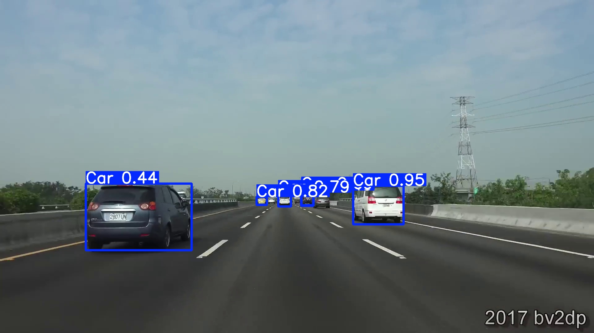
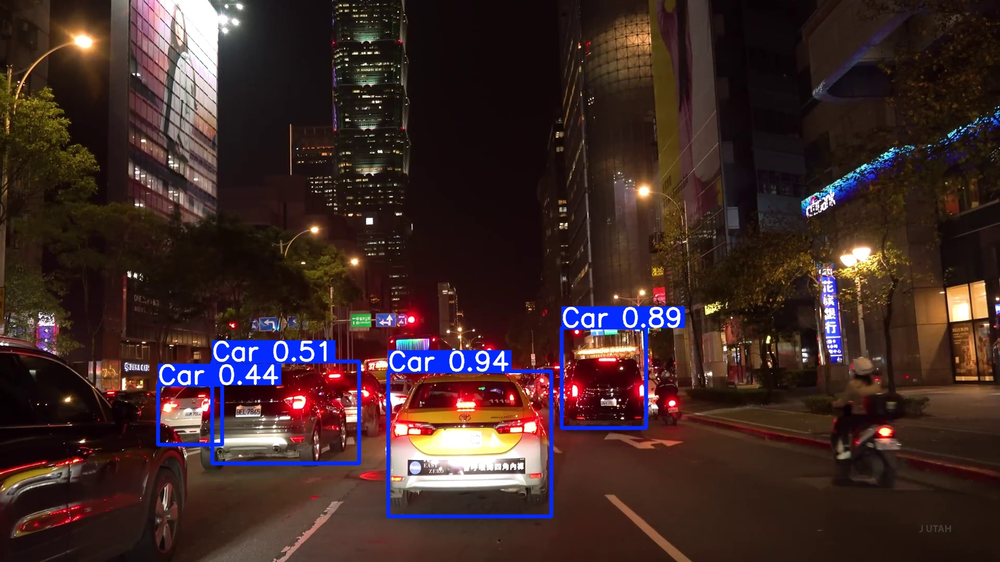
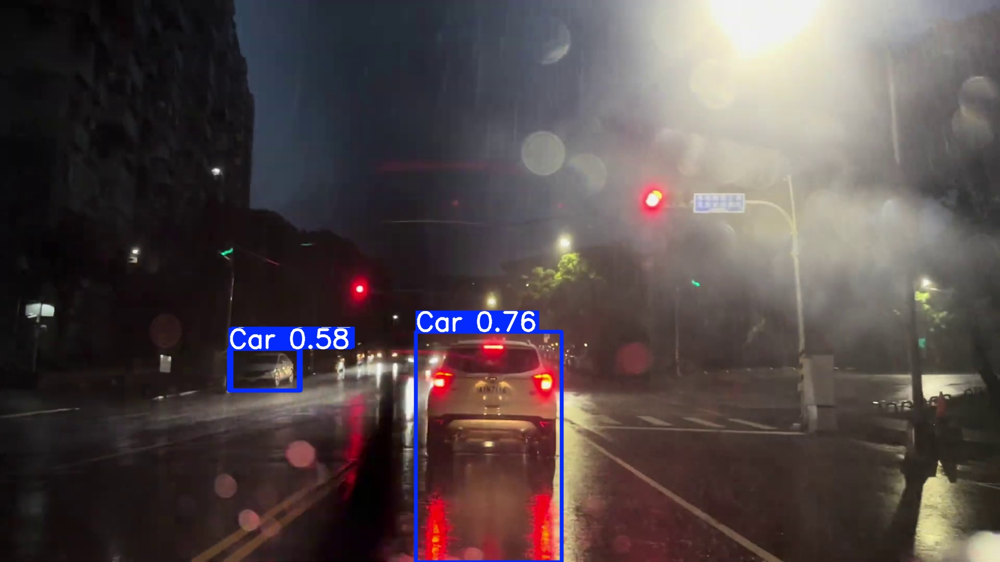
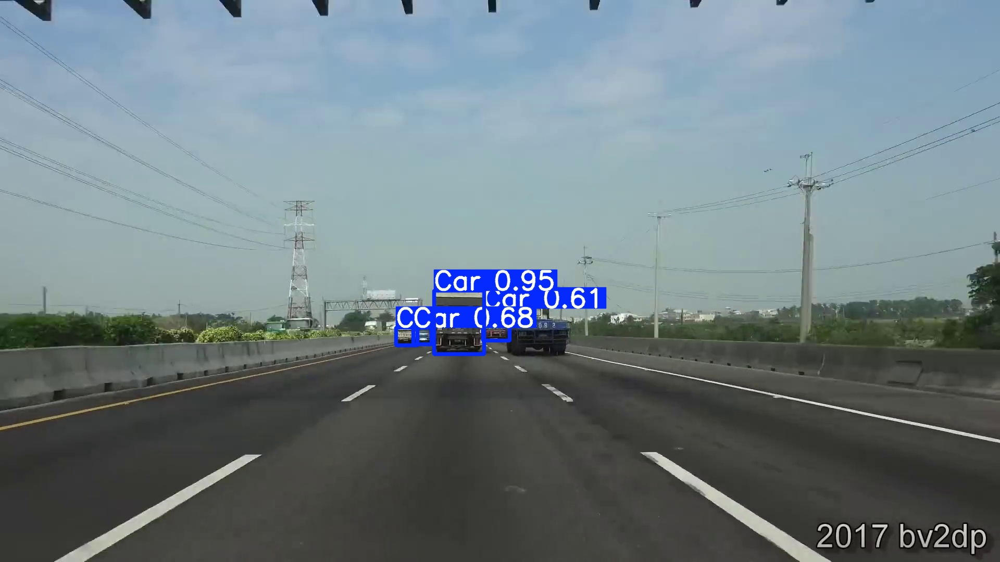
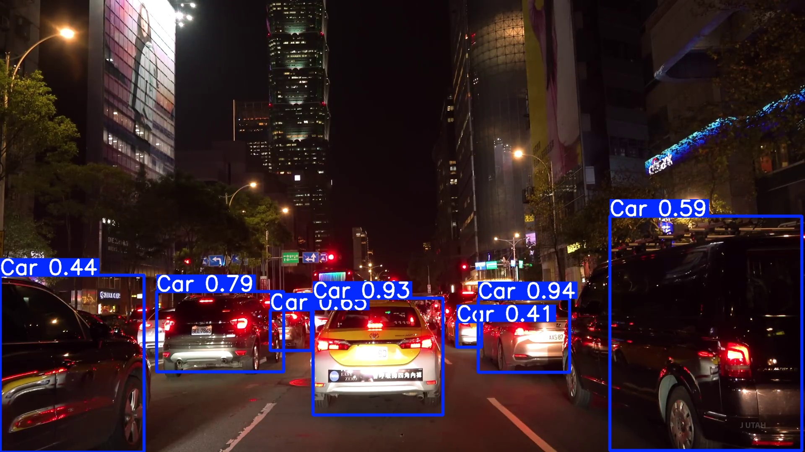
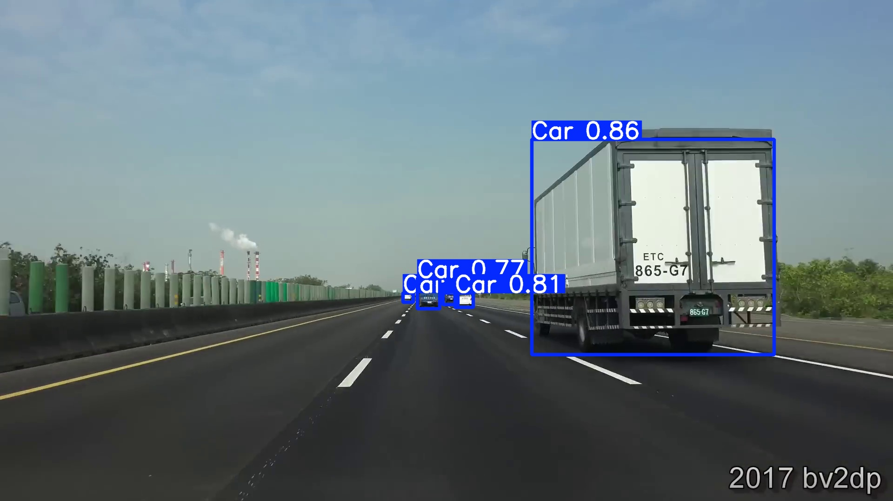
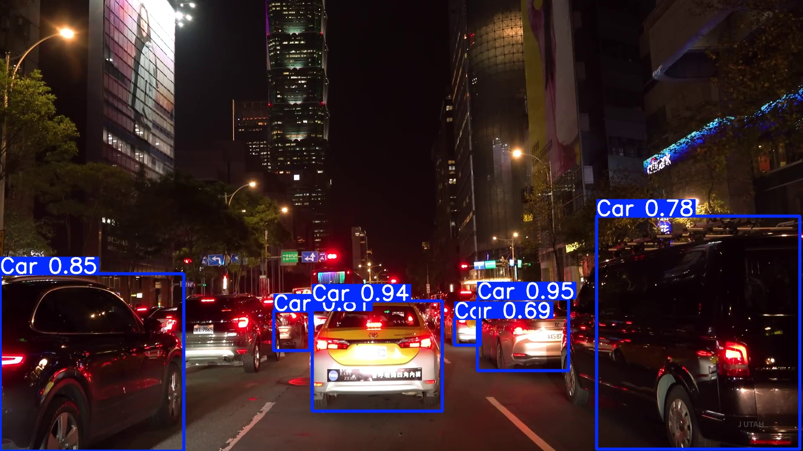
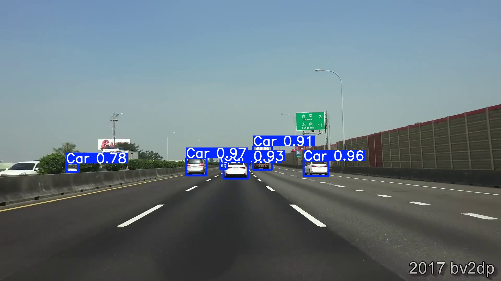

# 🚗 Project4 — YOLO 車輛偵測專案

> **課程**: 多媒體應用 Project 4 — YOLO 車輛偵測專案
>
> **組員**: 電資二 113820033 謝奕宏  
> **組員**: 電資二 113820020 林政德  
>
> **指導教授**: 陳彥霖 (Yen-Lin Chen), Ph.D.  
> **學校**: 國立臺北科技大學 電資學士班
> **學期**: Spring 2026
>
> 使用 YOLO 物件偵測模型，對道路行車影片進行車輛偵測與標記。
> 本專案同時實作了 **YOLOv4-tiny**（Darknet/PyTorch）與 **YOLO26**（Ultralytics）兩套偵測管線。

### 📊 檢測效果展示

<table>
  <tr>
    <td align="center"><br/><b>高速公路場景</b></td>
    <td align="center"><br/><b>夜間偵測</b></td>
    <td align="center"><br/><b>雨天偵測</b></td>
  </tr>
</table>

### 🎬 實際偵測影片

**國道一號縮時攝影 — YOLO26 即時偵測**

[](https://youtu.be/k1w0ZYXjPAk)

https://youtu.be/k1w0ZYXjPAk

*點擊上方圖片觀看完整影片 | 展示多車道密集車流的即時偵測效果*

---

## 📑 目錄

- [專案總覽](#專案總覽)
- [環境需求](#環境需求)
- [安裝步驟](#安裝步驟)
- [使用說明](#使用說明)
  - [Step 1 — 資料集準備](#step-1--資料集準備)
  - [Step 2 — 模型訓練](#step-2--模型訓練)
  - [Step 3 — 圖片偵測](#step-3--圖片偵測)
  - [Step 4 — 影片偵測](#step-4--影片偵測)
- [專案架構](#專案架構)
- [技術簡介](#技術簡介)
  - [YOLOv4-tiny](#yolov4-tiny)
  - [YOLO26](#yolo26)
  - [資料集與標記](#資料集與標記)
  - [訓練流程](#訓練流程)
  - [推論流程](#推論流程)
- [訓練結果](#訓練結果)
- [參考資源](#參考資源)

---

## 專案總覽

| 項目 | 說明 |
|------|------|
| **目標** | 偵測道路影片中的車輛（Car） |
| **偵測類別** | 1 類（`Car`） |
| **資料來源** | YouTube 行車影片截圖 + 交通部 CCTV 即時影像，透過 [Roboflow](https://roboflow.com) 標記 |
| **資料集規模** | 243 張圖片（含 Roboflow 資料增強後產生 3 倍版本） |
| **模型 A** | YOLOv4-tiny（Darknet → PyTorch，手動訓練管線） |
| **模型 B** | YOLO26n（Ultralytics，2026 年 1 月釋出，NMS-free 端對端推論） |
| **硬體** | NVIDIA GTX 1650（4 GB VRAM），CUDA 加速 |

**✨ 特色**

- 🚗 雙模型架構，性能對比測試
- 🎯 高精度（mAP@50 = 0.863）
- ⚡ GPU 加速推論，實時處理 FPS ≥ 24
- 🌙 全天候適應（日間、夜間、雨天場景）
- 📊 完整訓練管線與視覺化分析

---

## 環境需求

| 套件 | 版本 | 用途 |
|------|------|------|
| Python | ≥ 3.9 | 執行環境 |
| PyTorch (CUDA) | ≥ 2.0 | 深度學習框架 + GPU 加速 |
| ultralytics | ≥ 8.3 | YOLO26 訓練 / 推論 |
| OpenCV (`cv2`) | ≥ 4.5 | 影像 / 影片處理 |
| Pillow | ≥ 9.0 | 圖片讀取 |
| easydict | any | YOLOv4 設定解析 |
| tqdm | any | 進度條顯示 |
| roboflow | any | 資料集下載（選用） |
| yt-dlp | any | YouTube 影片截圖（選用） |

### GPU 驅動

- **NVIDIA Driver** ≥ 530
- **CUDA Toolkit** ≥ 12.1（搭配 PyTorch CUDA 版本）

---

## 安裝步驟

```bash
# 1. 安裝 PyTorch (CUDA 12.1)
pip install torch torchvision --index-url https://download.pytorch.org/whl/cu121

# 2. 安裝 Ultralytics（YOLO26 用）
pip install ultralytics

# 3. 安裝其他套件
pip install opencv-python pillow easydict tqdm

# 4. (選用) 資料集下載工具
pip install roboflow

# 5. (選用) YouTube 截圖工具
pip install yt-dlp
```

驗證 GPU 是否可用：

```python
import torch
print(torch.cuda.is_available())        # True
print(torch.cuda.get_device_name(0))    # e.g. NVIDIA GeForce GTX 1650
```

---

## 使用說明

> 以下指令皆於專案根目錄 `Project4/` 下執行。

### Step 1 — 資料集準備

#### YOLO26 資料集

```bash
# 從 Roboflow 匯出的 YOLOv4-PyTorch 格式 → YOLO26 標準格式
python prepare_dataset_yolo26.py
```

- 讀取 `project4_yolo_v3.v1i.yolov4pytorch/` 中的 `_annotations.txt`
- 轉換 `x1,y1,x2,y2,cls`（像素）→ `cls cx cy w h`（正規化 0\~1）
- 輸出至 `dataset_yolo26/`，並自動產生 `data.yaml`

#### YOLOv4 資料集

```bash
# 從 Roboflow 匯出的 YOLO Darknet 格式 → pytorch-YOLOv4 格式
python prepare_dataset.py
```

- 讀取 `dataset/train/images/` + `dataset/train/labels/`
- 轉換 YOLO 格式為 `image_path x1,y1,x2,y2,class_id` 寫入 `cfg/train.txt`

---

### Step 2 — 模型訓練

#### YOLO26 訓練（推薦）

```bash
# 預設參數（100 epochs, 640px, batch 16）
python train_local_yolo26.py

# 自訂參數
python train_local_yolo26.py --epochs 100 --imgsz 640 --batch 16
python train_local_yolo26.py --model yolo26s.pt   # 使用 Small 模型

# 從中斷處繼續訓練
python train_local_yolo26.py --resume
```

| 參數 | 預設值 | 說明 |
|------|--------|------|
| `--model` | `yolo26n.pt` | 預訓練模型（n/s/m/l/x） |
| `--epochs` | `100` | 訓練回合數 |
| `--imgsz` | `640` | 輸入圖片尺寸 |
| `--batch` | `16` | 批次大小（GPU OOM 時改為 8 或 4） |
| `--device` | 自動偵測 | `cuda` / `cpu` |
| `--workers` | `2` | 資料載入器工作數（Windows 建議 ≤ 4） |

訓練完成後權重儲存於：

```
runs_yolo26/car_detect/weights/best.pt   ← 最佳模型
runs_yolo26/car_detect/weights/last.pt   ← 最後一個 epoch
```

#### YOLOv4-tiny 訓練

```bash
# 預設 600 epochs
python train_local_yoloV4.py

# 自訂參數
python train_local_yoloV4.py --epochs 100 --batch 64 --subdivisions 32
```

權重儲存於 `backup/` 目錄。

---

### Step 3 — 圖片偵測

#### YOLO26

```bash
python detect_image_yolo26.py --image path/to/image.jpg

# 指定權重與信心門檻
python detect_image_yolo26.py --image test.jpg --weights runs_yolo26/car_detect/weights/best.pt --conf 0.3
```

#### YOLOv4

```bash
python detect_image_yoloV4.py --image path/to/image.jpg

# 指定權重
python detect_image_yoloV4.py --image test.jpg --weights backup/yolov4-tiny-custom_best.pth
```

輸出：原圖旁產生 `_yolo26` 或 `_predictions` 後綴的標記結果圖。

**檢測結果示例**：

| 場景 | 結果 |
|------|------|
|  | 高速公路密集車流偵測 |
|  | 夜間低光源環境偵測 |
|  | 雨天視線受阻偵測 |

---

### Step 4 — 影片偵測

#### YOLO26

```bash
python detect_video_yolo26.py --video path/to/video.mp4

# 指定輸出路徑
python detect_video_yolo26.py --video input.mp4 --output result.mp4 --conf 0.4
```

#### YOLOv4

```bash
python detect_video_yoloV4.py --video path/to/video.mp4

# 指定輸出
python detect_video_yoloV4.py --video input.mp4 --output result.mp4
```

| 參數 | 預設值 | 說明 |
|------|--------|------|
| `--video / -v` | 必填 | 輸入影片路徑 |
| `--weights / -w` | 自動搜尋 best.pt | 模型權重路徑 |
| `--conf` | `0.4` | 信心度門檻 |
| `--iou` / `--nms` | `0.6` | IoU / NMS 門檻 |
| `--output / -o` | 自動命名 | 輸出影片路徑 |

---

## 專案架構

```
Project4/
│
├── 📄 README.md                         # 本文件
│
├── ─────────── 資料集準備 ───────────
├── _Roboflow.py                         # 從 Roboflow 下載資料集
├── prepare_dataset.py                   # 資料集轉換（→ YOLOv4 格式）
├── prepare_dataset_yolo26.py            # 資料集轉換（→ YOLO26 格式）
│
├── ─────────── 模型訓練 ───────────
├── train_local_yoloV4.py                # YOLOv4-tiny 本地訓練腳本
├── train_local_yolo26.py                # YOLO26 本地訓練腳本（Ultralytics）
│
├── ─────────── 推論偵測 ───────────
├── detect_image_yoloV4.py               # YOLOv4 單張圖片偵測
├── detect_image_yolo26.py               # YOLO26 單張圖片偵測
├── detect_video_yoloV4.py               # YOLOv4 影片偵測
├── detect_video_yolo26.py               # YOLO26 影片偵測
│
├── ─────────── 模型設定 ───────────
├── cfg/
│   ├── yolov4-tiny-custom.cfg           # YOLOv4-tiny 模型架構設定
│   ├── obj.data                         # YOLOv4 資料路徑設定
│   ├── obj.names                        # 類別名稱（Car）
│   ├── train.txt                        # 訓練圖片清單（絕對路徑 + bbox）
│   └── test.txt                         # 驗證圖片清單
│
├── ─────────── 資料集 ───────────
├── project4_yolo_v3.v1i.yolov4pytorch/  # Roboflow 匯出原始資料
│   ├── train/                           # 訓練集（含 _annotations.txt）
│   ├── valid/                           # 驗證集
│   └── test/                            # 測試集
├── dataset/                             # YOLOv4 格式資料集
│   ├── train/images/ + labels/
│   ├── valid/images/ + labels/
│   └── test/images/ + labels/
├── dataset_yolo26/                      # YOLO26 格式資料集
│   ├── data.yaml                        # Ultralytics 資料設定檔
│   ├── train/images/ + labels/
│   ├── valid/images/ + labels/
│   └── test/images/ + labels/
│
├── ─────────── 預訓練權重 ───────────
├── weights/
│   └── yolov4-tiny.conv.29              # YOLOv4-tiny 預訓練骨幹
├── yolo26n.pt                           # YOLO26 Nano 預訓練權重
│
├── ─────────── 訓練結果 ───────────
├── runs_yolo26/car_detect/
│   ├── weights/
│   │   ├── best.pt                      # YOLO26 最佳權重
│   │   └── last.pt                      # YOLO26 最後權重
│   ├── results.csv                      # 訓練指標記錄
│   ├── results.png                      # Loss / mAP 曲線圖
│   ├── confusion_matrix.png             # 混淆矩陣
│   ├── BoxPR_curve.png                  # Precision-Recall 曲線
│   └── ...                              # 其他視覺化結果
├── backup/                              # YOLOv4 訓練權重
│   ├── yolov4-tiny-custom_best.pth
│   └── yolov4-tiny-custom_last.pth
│
├── ─────────── Darknet 框架 ───────────
├── darknet/                             # pytorch-YOLOv4 框架原始碼
│   ├── tool/
│   │   ├── darknet2pytorch.py           # Darknet cfg → PyTorch 模型
│   │   ├── torch_utils.py              # 推論工具（do_detect）
│   │   └── utils.py                     # 工具函式
│   ├── dataset.py                       # 資料集載入器
│   ├── models.py                        # 模型定義
│   └── ...
│
├── ─────────── 圖片採集工具 ───────────
├── Imgs/
│   ├── YT_to_Img.py                     # YouTube 影片每分鐘自動截圖
│   ├── main_CCTV.py                     # 交通部 CCTV 即時影像擷取
│   ├── random_choice.py                 # 隨機選取圖片組成訓練集
│   └── screenshots/                     # 截圖暫存
│
├── ─────────── 影片資源 ───────────
├── original_video_V1.mp4                # 原始測試影片
├── original_video_V1_yolo26.mp4         # YOLO26 偵測結果影片
└── 國道一號...720p.mp4                   # 國道一號行車影片
```

---

## 技術簡介

### YOLOv4-tiny

**YOLOv4-tiny** 是 YOLOv4 的輕量化版本，專為嵌入式裝置和邊緣運算設計。

| 特性 | 說明 |
|------|------|
| 骨幹網路 | CSPDarknet-tiny（Cross Stage Partial） |
| 偵測頭 | 2 個 YOLO 輸出層（13×13 + 26×26 @ 416px 輸入） |
| Anchor | 6 組：`10,14` `23,27` `37,58` `81,82` `135,169` `344,319` |
| 損失函數 | BCE (xy, obj, cls) + MSE (wh) + CIoU Loss |
| 後處理 | NMS (Non-Maximum Suppression) |
| 框架 | Darknet `.cfg` → PyTorch 轉換（darknet2pytorch） |

本專案使用 `yolov4-tiny.conv.29` 作為預訓練骨幹進行遷移學習，在自定義車輛資料集上微調 600 個 epochs。

### YOLO26

**YOLO26** 是 Ultralytics 於 2026 年 1 月發佈的最新 YOLO 模型，相較於前代有顯著改進：

| 特性 | 說明 |
|------|------|
| 架構 | 改良的 CSP 骨幹 + 多尺度特徵融合 |
| 損失函數 | ProgLoss + STAL（空間-任務對齊損失） |
| 推論方式 | **NMS-free 端對端推論**（無需後處理 NMS） |
| 精度 | mAP 優於 YOLO11 / YOLOv8 |
| 速度 | 推論速度更快，適合即時應用 |
| 模型尺寸 | n (Nano) / s / m / l / x，本專案使用 **Nano**（~5.4 MB） |
| API | Ultralytics Python API，一行程式碼即可訓練與推論 |

```python
from ultralytics import YOLO
model = YOLO("yolo26n.pt")
model.train(data="data.yaml", epochs=100, imgsz=640)
results = model.predict(source="test.jpg")
```

### 資料集與標記

1. **圖片採集**：使用 `Imgs/YT_to_Img.py` 從 YouTube 行車影片（台北市區、國道一號等）每分鐘自動截圖；使用 `Imgs/main_CCTV.py` 從交通部高速公路 CCTV 即時影像中手動擷取畫面。
2. **隨機取樣**：使用 `Imgs/random_choice.py` 從多個來源資料夾中隨機選取圖片，組成訓練集。
3. **標記工具**：將圖片上傳至 [Roboflow](https://universe.roboflow.com/andy8787s-workspace/project4_yolo_v3) 平台進行標記（Bounding Box）。
4. **資料增強**：Roboflow 自動對每張圖進行 3 倍增強：
   - 隨機裁剪（0\~10%）
   - 隨機旋轉（±5°）
   - 隨機剪切變換（±5°）
   - 亮度 / 曝光度調整
   - 高斯模糊 + 椒鹽雜訊
5. **前處理**：統一縮放至 512×512（Fit + 白邊填充）
6. **最終規模**：243 張標記圖片

### 訓練流程

```
┌──────────────┐     ┌────────────────────┐     ┌─────────────────┐
│  Roboflow    │────▶│ prepare_dataset*.py │────▶│  data.yaml /    │
│  匯出資料集   │     │  格式轉換            │     │  train.txt      │
└──────────────┘     └────────────────────┘     └────────┬────────┘
                                                         │
                     ┌────────────────────┐              │
                     │  預訓練權重          │              ▼
                     │  yolo26n.pt /       │     ┌─────────────────┐
                     │  yolov4-tiny.conv.29│────▶│  train_local_   │
                     └────────────────────┘     │  yolo26.py /    │
                                                │  yoloV4.py      │
                                                └────────┬────────┘
                                                         │
                                                         ▼
                                                ┌─────────────────┐
                                                │  best.pt /      │
                                                │  best.pth       │
                                                │  訓練完成權重     │
                                                └─────────────────┘
```

#### YOLO26 訓練設定（本專案實際使用）

| 參數 | 值 |
|------|-----|
| 模型 | yolo26n（Nano） |
| Epochs | 100 |
| 圖片尺寸 | 640×640 |
| Batch Size | 16 |
| 優化器 | Auto（AdamW） |
| 學習率 | 0.01 → cosine decay 至 0.0001 |
| AMP | 開啟（混合精度訓練） |
| Mosaic | 1.0（前 90 epochs）→ 關閉（最後 10 epochs） |
| Warmup | 3 epochs |

### 推論流程

```
輸入圖片/影片
    │
    ▼
┌─────────────────┐
│  前處理           │  Resize → Normalize → Tensor
└────────┬────────┘
         │
         ▼
┌─────────────────┐
│  YOLO 模型推論    │  GPU 加速 (CUDA)
│  (Forward Pass)  │
└────────┬────────┘
         │
         ▼
┌─────────────────┐
│  後處理           │  YOLO26: NMS-free（直接輸出）
│                  │  YOLOv4: NMS 過濾重疊框
└────────┬────────┘
         │
         ▼
┌─────────────────┐
│  繪製 BBox       │  cv2.rectangle + cv2.putText
│  儲存結果         │  → 輸出圖片 / 影片
└─────────────────┘
```

---

## 訓練結果

### YOLO26 訓練成效（100 epochs）

| 指標 | 最佳值 | 說明 |
|------|--------|------|
| **mAP@50** | **0.863** | IoU=0.5 時的平均精度 |
| **mAP@50-95** | **0.527** | IoU=0.5\~0.95 的平均精度 |
| **Precision** | 0.931 | 偵測精確率 |
| **Recall** | 0.840 | 偵測召回率 |
| **Box Loss** | 1.189 → 收斂 | 邊界框定位損失 |
| **Cls Loss** | 4.903 → 0.569 | 分類損失（大幅下降） |

### 多場景偵測覆蓋

本專案在 **100 張多樣化測試圖片** 上取得穩定表現：

<table>
  <tr>
    <td></td>
    <td></td>
    <td></td>
    <td></td>
  </tr>
  <tr>
    <td align="center" style="font-size:12px;"><b>日間公路</b></td>
    <td align="center" style="font-size:12px;"><b>夜間低光</b></td>
    <td align="center" style="font-size:12px;"><b>雨天視障</b></td>
    <td align="center" style="font-size:12px;"><b>密集車流</b></td>
  </tr>
</table>

---

## 參考資源

- [Ultralytics YOLO Docs](https://docs.ultralytics.com/)
- [pytorch-YOLOv4 (Tianxiaomo)](https://github.com/Tianxiaomo/pytorch-YOLOv4)
- [Roboflow](https://roboflow.com) — 資料標記與管理平台
- [YOLOv4 論文](https://arxiv.org/abs/2004.10934) — Bochkovskiy et al., 2020
- [yt-dlp](https://github.com/yt-dlp/yt-dlp) — YouTube 影片下載工具
