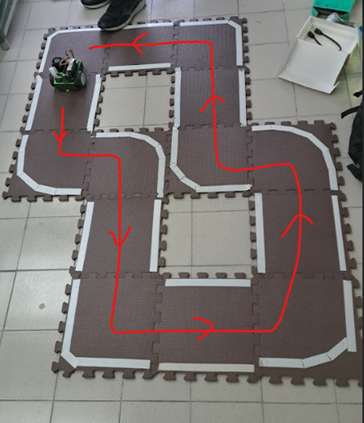
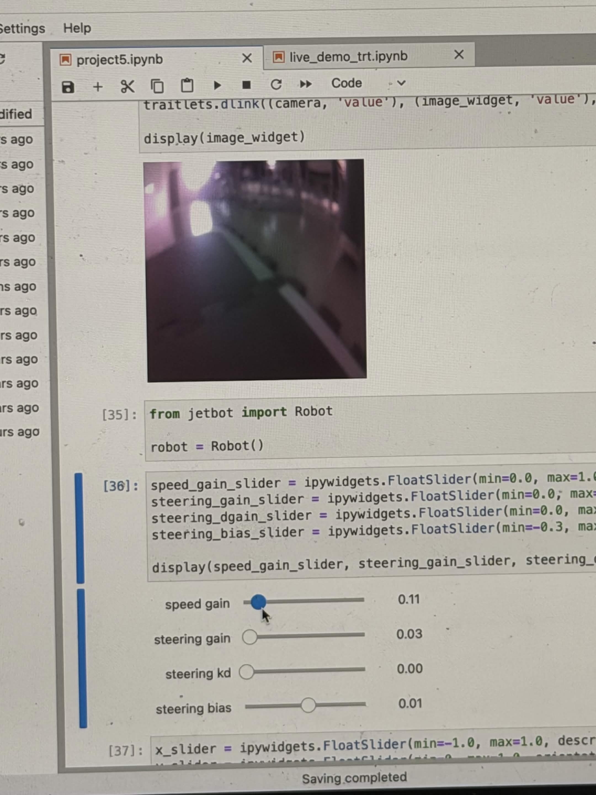
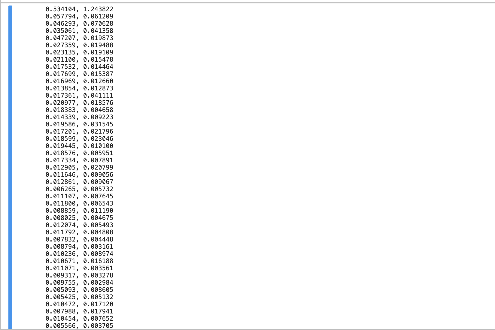
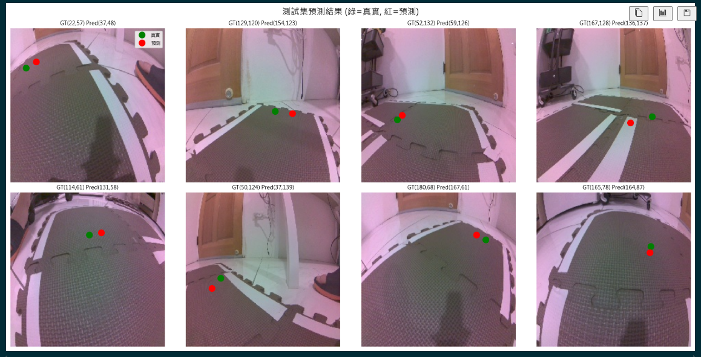

<div align="center">

# 🏎️ JetBot AI 道路辨識專案

**多媒體應用 Project 5 — Autonomous Road Following**


<br /><br />

使用深度學習技術訓練 **JetBot**，將攝影機即時影像轉換為轉向座標 (X, Y)，實現硬體端到端的 **自主道路跟隨功能 (Road Following)**。<br />
本專案包含資料收集、模型訓練 (ResNet-18) 與 TensorRT 加速推論。

</div>

---

<details open>
<summary><b>🧑‍🎓 專案團隊 & 課程資訊</b></summary>

<br>

- **指導教授**: 陳彥霖 (Yen-Lin Chen), Ph.D.
- **課程單位**: 國立臺北科技大學 電資學士班 / Spring 2026
- **組員**:
  - 113820033 電資二 謝奕宏
  - 113820020 電資二 林政德
  - 112820034 電資二 呂伊茹

</details>

<div align="center">

### 🎬 成果精華搶先看

<table width="90%">
  <tr>
    <td align="center" width="50%">
      <b>🗺️ 複雜路徑完整繞圈測試</b><br><br>
      <video src="_record_video/complex_path_record.mp4" controls="controls" width="100%"></video>
      <br>
    </td>
    <td align="center" width="50%">
      <b>📺 YouTube 合集精華影片</b><br><br>
      <a href="https://youtube.com/shorts/3XCSL3uAbdk?feature=share">
        
      </a><br><br>
      <a href="https://youtube.com/shorts/3XCSL3uAbdk?feature=share"><b>▶️ 點此觀看完整合集</b></a>
    </td>
  </tr>
</table>

</div>

---

## 📋 專案簡介

本專案使用深度學習技術，訓練一個 **迴歸模型 (Regression Model)**，讓 JetBot 的攝影機擷取的即時影像能夠轉換為馬達所需的 **轉向座標 (X, Y)**，實現自主道路跟隨功能。

核心技術：

- **模型架構**：ResNet-18（預訓練 + 遷移學習）
- **任務類型**：迴歸（Regression），輸出 X, Y 座標
- **訓練框架**：PyTorch + CUDA GPU 加速
- **控制方式**：PD 控制器將預測座標轉為馬達出力

---

## 📁 專案結構

```
Project5/
├── dataset_xy/                    # 訓練資料集（450 張標記影像）
│   ├── xy_050_077_xxx.jpg         # 格式：xy_{X}_{Y}_{uuid}.jpg
│   ├── xy_100_120_xxx.jpg
│   └── ...
├── _record_video/                 # 實際運作影片（JetBot 在跑道上行駛錄影）
│   ├── complex_path_record.mp4    # 複雜路徑完整繞圈測試
│   ├── complex_path.png           # 複雜路徑跑道俯視圖
│   ├── prediction_results.png     # 測試集預測結果（綠 = 真實座標，紅 = 預測座標）
│   ├── IMG_4024.mov
│   ├── IMG_4032.mov
│   ├── IMG_4034.mov
│   ├── IMG_4035.mov
│   ├── IMG_4036.mov
│   └── IMG_6829.mov
├── ipynb_imgs/                    # Notebook 程式碼截圖與參數設定畫面
│   ├── IMG_6824.jpg
│   ├── IMG_6874.png
│   └── ...（共 14 張截圖）
├── data_collection_gamepad.ipynb  # 資料收集 Notebook（JetBot 上執行）
├── train_model.ipynb              # 模型訓練 Notebook（GPU 加速）
├── live_demo_build_trt.ipynb      # TensorRT 模型轉換（JetBot 上執行）
├── live_demo_trt.ipynb            # 即時推論 + 道路跟隨（JetBot 上執行）
├── project5.ipynb                 # 所有流程合併版 Notebook（資料收集 + 訓練 + TRT 轉換 + 即時推論）
├── best_steering_model_xy.pth     # 訓練完成後的最佳模型權重
├── AI.md                          # 專案技術說明文件
├── Project5_AI道路辨識.pdf         # 課程投影片
└── README.md                      # 本文件
```

---

## 🎬 成果展示 (Showcase)

<div align="center">
  <h3>🏎️ JetBot 實際運作紀錄</h3>
  <p>透過 TensorRT 加速推論與 PD 控制器調校，JetBot 能夠順暢且即時地跟隨道路。</p>
  <table width="100%">
    <tr>
      <td align="center" width="50%">
        <b>💡 初版低速測試示</b><br>
        <video src="_record_video/IMG_6829.mov" controls="controls" width="100%"></video>
      </td>
      <td align="center" width="50%">
        <b>🚀 連續彎道與直道測試</b><br>
        <video src="_record_video/IMG_4032.mov" controls="controls" width="100%"></video>
      </td>
    </tr>
    <tr>
      <td align="center">
        <b>✨ 穩定繞圈運行展示</b><br>
        <video src="_record_video/IMG_4024.mov" controls="controls" width="100%"></video>
      </td>
      <td align="center">
        <b>📉 調整 PD 增益抑制震盪</b><br>
        <video src="_record_video/IMG_4036.mov" controls="controls" width="100%"></video>
      </td>
    </tr>
    <tr>
      <td align="center" colspan="2">
        <b>🗺️ 複雜路徑完整繞圈測試</b><br>
        <video src="_record_video/complex_path_record.mp4" controls="controls" width="60%"></video>
      </td>
    </tr>
  </table>
  <p><em>⚠️ 註：所有 7 段原始運作錄影均可於 <code>_record_video/</code> 目錄中查看</em></p>
</div>

<br>

<div align="center">
  <h3>💻 實作畫面與開發截圖</h3>
  <table width="100%">
    <tr>
      <td align="center" width="50%">
        <br>
        <b>即時預測準確度與相機採集畫面</b>
      </td>
      <td align="center" width="50%">
        <br>
        <b>訓練過程 Loss 曲線與參數調整</b>
      </td>
    </tr>
    <tr>
      <td align="center" colspan="2">
        <br>
        <b>測試集預測結果（綠 = 真實座標，紅 = 預測座標）</b>
      </td>
    </tr>
  </table>
  <p><em>📁 完整 14 張開發與測試流程截圖請見 <code>ipynb_imgs/</code> 靜態圖庫</em></p>
</div>

---

## 🔧 環境需求

| 項目 | 需求 |
|------|------|
| Python | 3.10+ |
| PyTorch | 2.x (CUDA) |
| torchvision | 對應 PyTorch 版本 |
| CUDA | 11.x 以上 |
| GPU | NVIDIA（本專案使用 GTX 1650） |
| 其他 | Pillow, matplotlib, numpy |

### 安裝步驟

```bash
# 安裝 PyTorch（CUDA 版本）
pip install torch torchvision --index-url https://download.pytorch.org/whl/cu118

# 安裝其他依賴
pip install matplotlib numpy Pillow
```

---

## 📊 資料集說明

### 格式

資料集位於 `dataset_xy/` 資料夾，每張影像的 **座標資訊直接編碼在檔名中**：

```
xy_{X座標}_{Y座標}_{uuid}.jpg
```

例如：`xy_050_077_d8d86ad0-4959-11f1-ba7c-7404f1c2a475.jpg`

### 統計

| 項目 | 數值 |
|------|------|
| 影像總數 | **450 張** |
| 影像尺寸 | **224 × 224** (RGB) |
| X 值範圍 | 0 ~ 224 |
| Y 值範圍 | 0 ~ 187+ |
| 正規化方式 | `(value - 112) / 112` → [-1, 1] |

### 資料收集流程

1. 透過 JetBot 前方 CSI 相機擷取 224×224 即時影像
2. 使用 Gamepad 或 UI 滑桿標記**目標行駛位置 (X, Y)**
3. 系統將影像與座標（編碼於檔名）一併儲存

---

## 🚀 訓練流程

### 快速開始

1. 確認 GPU 可用：

   ```python
   import torch
   print(torch.cuda.is_available())       # 應輸出 True
   print(torch.cuda.get_device_name(0))   # 例如 NVIDIA GeForce GTX 1650
   ```

2. 開啟 `train_model.ipynb`，**依序執行所有儲存格**。

### 訓練細節

| 參數 | 設定值 |
|------|--------|
| 模型架構 | ResNet-18 (pretrained on ImageNet) |
| 最後一層 | `Linear(512, 2)` → 輸出 (X, Y) |
| 損失函數 | MSE Loss（均方誤差） |
| 最佳化器 | Adam (lr=1e-3) |
| Batch Size | 8 |
| Epochs | 70 |
| Train/Test | 90% / 10% |
| 硬體加速 | **CUDA GPU（強制）** |

### 資料增強

| 方法 | 說明 |
|------|------|
| 隨機水平翻轉 | 同時翻轉 X 座標（`x = -x`） |
| 色彩擾動 | brightness=0.2, contrast=0.2, saturation=0.2, hue=0.1 |
| 正規化 | ImageNet 標準（mean=[0.485,0.456,0.406], std=[0.229,0.224,0.225]） |

### 模型儲存策略

每個 Epoch 結束後，在測試集上計算 Loss：

- 若當前 Test Loss **低於歷史最低**，自動儲存為 `best_steering_model_xy.pth`
- 確保最終模型為訓練過程中最佳的版本

---

## 🎮 PD 控制原理

模型推論後，透過 PD 控制器將預測座標轉為馬達出力：

```
angle = arctan2(x, y)
pid = angle × P_gain + (angle - angle_last) × D_gain
steering = pid + bias

left_motor  = clamp(speed_gain + steering, 0, 1)
right_motor = clamp(speed_gain - steering, 0, 1)
```

| 參數 | 說明 |
|------|------|
| `speed_gain` | 速度增益（建議初始值 0.15） |
| `P_gain` | 比例項增益（修正當前誤差） |
| `D_gain` | 微分項增益（抑制震盪） |
| `bias` | 馬達公差修正值 |

---

## 🔄 TensorRT 模型轉換

### 為什麼需要 TensorRT？

JetBot 的 Jetson Nano 運算資源有限，直接使用 PyTorch 模型進行推論會導致延遲過高。
**TensorRT** 是 NVIDIA 針對 GPU 推論優化的加速引擎，可以：

- 🚀 推論速度提升 **2-5 倍**
- 📉 降低記憶體使用量
- ⚡ 支援 **FP16 半精度** 加速（Jetson Nano 原生支援）

### 轉換環境

> ⚠️ **重要**：TensorRT 轉換必須在 **Jetson Nano（JetBot）** 上執行，不能在本地 Windows/PC 上執行。
> `torch2trt` 套件依賴 TensorRT 引擎，僅在 Jetson 平台上可用。

| 項目 | 需求 |
|------|------|
| 執行平台 | **Jetson Nano（JetBot）** |
| Python | 3.6+ |
| PyTorch | JetPack 內建版本 |
| torch2trt | JetBot 預裝 / 手動安裝 |
| 輸入模型 | `best_steering_model_xy.pth` |
| 輸出模型 | `best_steering_model_xy_trt.pth` |

### 轉換流程（`live_demo_build_trt.ipynb`）

```
步驟 1：匯入套件 (torch, torchvision, torch2trt)
    ↓
步驟 2：載入 PyTorch 模型
    ├── 建立 ResNet-18 架構（fc → Linear(512, 2)）
    ├── 載入訓練權重 best_steering_model_xy.pth
    └── 搬到 GPU + eval() 模式
    ↓
步驟 3：TensorRT 轉換
    ├── 建立範例輸入 tensor (1, 3, 224, 224)
    └── torch2trt(model, [sample_input], fp16_mode=True)
    ↓
步驟 4：驗證精度
    ├── 比較 PyTorch vs TensorRT 輸出
    └── 確認最大誤差 < 0.01
    ↓
步驟 5：儲存 TensorRT 模型
    └── torch.save(model_trt.state_dict(), 'best_steering_model_xy_trt.pth')
```

### 操作步驟

1. 將 `best_steering_model_xy.pth` 上傳到 JetBot
2. 在 JetBot 的 Jupyter Notebook 中開啟 `live_demo_build_trt.ipynb`
3. **依序執行所有儲存格**
4. 轉換過程約需 **2-5 分鐘**
5. 完成後自動儲存 `best_steering_model_xy_trt.pth`

---

## ⚠️ 注意事項

- **首次執行**時，建議先把 `speed_gain` 調小（例如 0.15），避免 JetBot 因模型預測不準確而衝出跑道
- 在 Jupyter Notebook 切換不同 `.ipynb` 時，記得執行 `camera.stop()` 釋放相機資源
- 座標系統：X 軸 -1（左）→ 1（右），可能需要與 OpenCV 座標轉換
- **TensorRT 轉換** 必須在 Jetson Nano 上執行，本地 PC 會出現 `ModuleNotFoundError: No module named 'torch2trt'`

---

## 📚 參考流程（完整部署）

| 步驟 | Notebook | 說明 |
|------|----------|------|
| 1 | `data_collection_gamepad.ipynb` | 資料收集（遊戲手把標記） |
| 2 | `train_model.ipynb` | PyTorch + GPU 訓練 |
| 3 | `live_demo_build_trt.ipynb` | 轉換為 TensorRT 模型 |
| 4 | `live_demo_trt.ipynb` | 即時推論 + 道路跟隨 |
| — | `project5.ipynb` | 上述四個 Notebook 的合併版（完整流程一次執行） |
