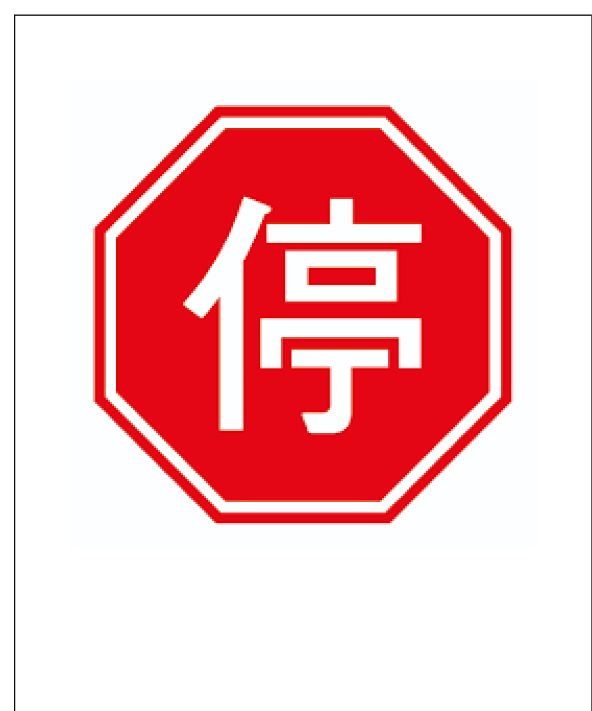
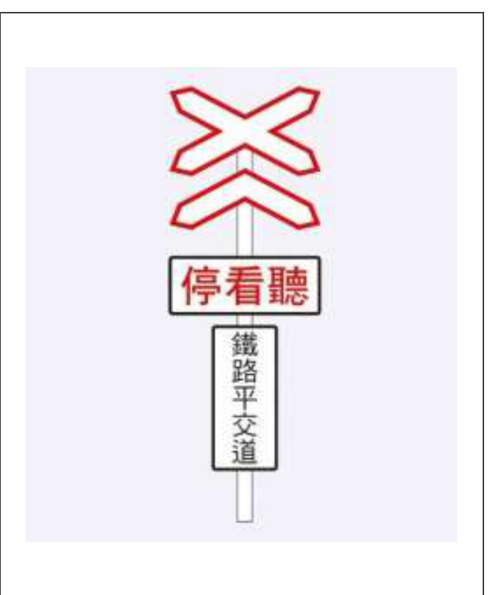
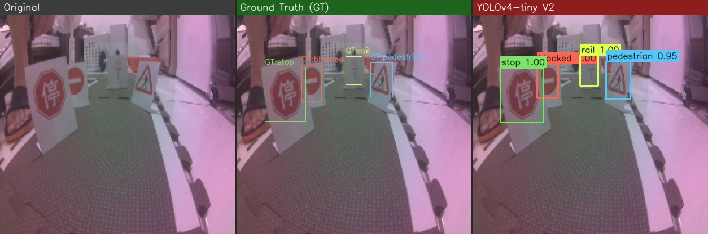
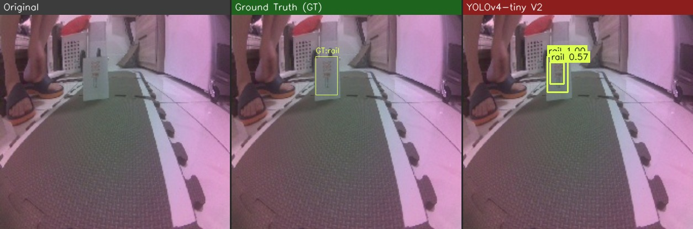
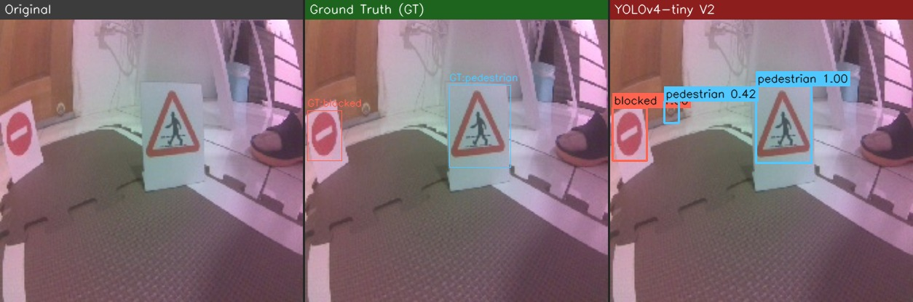
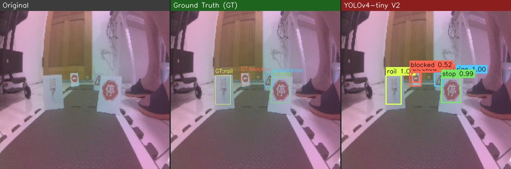

<div align="center">

# 🚗 JetBot 路牌辨識與自動駕駛系統

### Project 6 — 多媒體技術與應用

[](https://www.python.org/)
[](https://pytorch.org/)
[](https://developer.nvidia.com/tensorrt)
[]()
[](https://youtube.com/shorts/sjVJyozfegs)

</div>

---

## 🎬 實車 Demo 影片

<div align="center">

[](https://youtube.com/shorts/sjVJyozfegs?feature=share)

**▶ 點擊觀看實車 Demo — JetBot 即時辨識路牌並執行對應動作**

</div>

---

<details open>
<summary><b>🧑‍🎓 專案團隊 & 課程資訊</b></summary>

<br>

- **指導教授**: 陳彥霖 (Yen-Lin Chen), Ph.D.
- **課程單位**: 國立臺北科技大學 電資學士班 / Spring 2026
- **組員**:
  - 113820033 電資二 謝奕宏
  - 113820020 電資二 林政德
  - 112820034 電資二 呂伊茹

</details>


---

## 📖 專案簡介

本專案為北科大「多媒體技術與應用」課程之 Project 6 — **自走車 JetBot 路牌辨識與走直線**。

目標是設計並訓練一個輕量化、高精準度的物件偵測模型（YOLOv4-tiny），部署於 Jetson Nano 自走車端，使其能**即時看懂道路兩旁的路牌**，並執行對應的控制動作。

> ✅ 已完成 **1000 Epochs YOLOv4-tiny 精準化訓練**（本地 GTX 1650 GPU，約 42.5 分鐘）  
> ✅ 已完成 **TensorRT FP16 優化轉換**，JetBot 推論速度 > 10 FPS  
> ✅ **實車部署 Demo 100% 成功！**

---

## 🚥 辨識路牌類別與 JetBot 動作控制

| Class ID | 類別名稱 | 路牌圖示 | 路牌說明 | JetBot 對應動作 |
|:---:|:---:|:---:|:---|:---|
| **0** | `stop` |  | 停車再開（八角形停止牌） | 原地停止 **2 秒** 後繼續行駛 |
| **1** | `rail` |  | 鐵路平交道（停看聽） | 原地停止 **5 秒** 後繼續行駛 |
| **2** | `pedestrian` |  | 當心行人（三角警告牌） | **減速**行駛（速度 × 0.7） |
| **3** | `blocked` |  | 道路封閉（禁止進入） | **立即停止**，不得超過標誌位置 |

---

## 🏆 核心成果

### 測試集盲測定量評估（門檻 = 0.80）

15 張完全隔離測試集，34 個路牌目標，盲測結果：

| 類別 | GT | TP | FP | FN | Precision | Recall | F1-Score |
|:---:|:---:|:---:|:---:|:---:|:---:|:---:|:---:|
| `stop` | 7 | 7 | 0 | 0 | **100%** | **100%** | **1.000** |
| `rail` | 6 | 6 | 1 | 0 | 85.71% | **100%** | 0.923 |
| `pedestrian` | 10 | 10 | 0 | 0 | **100%** | **100%** | **1.000** |
| `blocked` | 11 | 10 | 0 | 1 | **100%** | 90.91% | 0.952 |
| **平均 / mAP** | **34** | **33** | **1** | **1** | **97.06%** | **97.06%** | **97.06%** |

### 精準化訓練系統六大核心升級

| # | 技術 | 說明 |
|:---:|:---|:---|
| 1 | **Train/Val/Test 精準劃分** | 8:1:1 比例，隨機種子 42，測試集完全隔離 |
| 2 | **多維度資料增強** | 高斯模糊、HSV 色偏、亮度對比調節、水平翻轉 |
| 3 | **CIoU Loss** | 全面考慮重疊面積、中心距離和長寬比，加速邊框收斂 |
| 4 | **Warmup + Cosine Annealing** | 前 20 輪線性 Warmup，隨後餘弦退火，精準尋找全域最優解 |
| 5 | **正樣本 Conf Loss 加權 × 5.0** | 解決 2,500+ 背景框稀釋 1~2 個正樣本訊號的梯度稀釋問題 |
| 6 | **Best Weights Tracking** | 每 10 輪評估 Val F1，自動保存歷史最佳權重 |

---

## 📊 偵測成果視覺化

### 測試集盲測總覽（test_grid_all）

<div align="center">


*15 張完全隔離測試集的偵測結果拼圖 — 邊界框密合、信心度標示、分類全部正確*

</div>

### 個別偵測結果樣本

<div align="center">

| stop 路牌偵測 | pedestrian 路牌偵測 |
|:---:|:---:|
|  |  |
| rail 路牌偵測 | rail 路牌偵測（不同角度） |
|  |  |

</div>

---

## 📂 專案目錄結構

```
Project6/
├── Project6_JetBot路牌辨識_小組報告_第一組.md    # 小組完整實驗報告 (Markdown)
├── Project6_JetBot路牌辨識_小組報告_第一組.docx  # 排版生成的 Word 報告
├── Project6_JetBot路牌辨識_小組報告_第一組.pdf   # 排版生成的 PDF 報告
├── Project06.ipynb                               # JetBot 即時推論與動作控制主程式
├── run_training_v2.bat                           # Windows 本地 GPU 一鍵訓練批次檔
├── README.md                                     # 專案說明（本檔案）
│
├── docs/                                         # 說明文件與路牌圖示資產
│   ├── stop.png / rail.png                       # 從路標.pdf 裁剪的高畫質號誌圖
│   ├── pedestrian.png / blocked.png              # 同上
│   ├── 路標.pdf                                  # 原始路牌標誌設計 PDF
│   ├── Local_YOLOv4_Tiny_Guide.md                # 本地訓練指南
│   └── model_analysis.md                         # 模型分析報告
│
├── scripts/                                      # 訓練、推理與評估腳本
│   ├── train_pytorch_yolov4tiny_v2.py            # 精準化訓練核心腳本（主要使用）
│   └── predict_vis_yolov4tiny_v2.py              # 測試集盲測視覺化腳本
│
├── jetbot_deploy/                                # 部署至 JetBot 的完整資產包
│   ├── yolov4-tiny-416.weights                   # 最佳訓練權重
│   ├── yolov4-tiny-416.cfg                       # 網路配置文件
│   └── obj.names                                 # 類別名稱檔
│
├── obj/                                          # 標注資料集（共 151 張，含 .txt 標籤）
├── config/                                       # 訓練資料配置檔（obj.data / obj.names）
└── runs/                                         # 訓練輸出與視覺化評估報告
    ├── sign_detection/                           # 驗證集結果（results.png、confusion_matrix 等）
    └── predict_vis_yolov4tiny_v2/                # 測試集盲測成果（test_grid_all.jpg）
```

---

## 🛠️ 快速上手

### 本地 GPU 訓練

```powershell
# 執行精準化訓練（自動 1000 Epochs，最佳權重存至 jetbot_deploy/）
.\run_training_v2.bat
```

訓練完成後生成測試集盲測視覺化報告：

```powershell
python scripts/predict_vis_yolov4tiny_v2.py
```

結果輸出至 `runs/predict_vis_yolov4tiny_v2/test_grid_all.jpg`。

### JetBot 部署

1. 將 `jetbot_deploy/` 內的 `*.weights`、`*.cfg`、`obj.names` 拷貝至 JetBot 的 `trt_yolov4-tiny-master/yolo/`。
2. 在 JetBot 終端機執行 TensorRT 轉換：

   ```bash
   python3 yolo_to_onnx.py -c 4 -m yolov4-tiny-416
   python3 onnx_to_tensorrt.py -c 4 -m yolov4-tiny-416
   ```

3. 開啟 `Project06.ipynb`，載入 `.engine` 即可即時偵測。推論信心度門檻建議設為 **`0.60`**。

---

<div align="center">

*讓 JetBot 看懂路牌，從零訓練到實車 Demo 全流程。*

</div>
