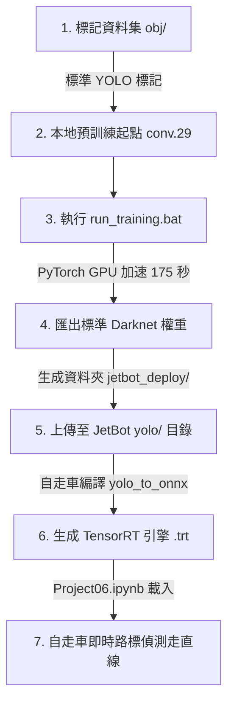

# 🏎️ JetBot AI 路牌辨識與自動駕駛：本地超高速 GPU 訓練指南

本指南專為 **國立臺北科技大學 多媒體技術與應用 (Project 6)** 設計。我們使用本地 **NVIDIA GeForce GTX 1650 GPU** 與 **PyTorch**，取代了原本緩慢的 Google Colab/WSL CPU 訓練，將訓練時間縮短至 **175 秒（不到 3 分鐘）**！

本指南將帶您一目瞭然地掌握「資料準備 ➡️ 本地 GPU 訓練 ➡️ 二進位導出 ➡️ JetBot 部署」的完整流暢程序。

> 目前專案已分區整理：訓練與工具腳本放在 `scripts/`，Darknet 相關設定檔放在 `config/`，詳細說明文件放在 `docs/`。

---

## 📋 專案流程圖



---

## 🛠️ 第一階段：本地極速 GPU 訓練 (PC 端)

本地環境已經為您全部配置完成。您只需要一鍵點擊，即可在 **3 分鐘內** 完成模型訓練！

### 1. 確認您的訓練輸入檔案

* 📁 **`obj/`** 資料夾：內含 151 張路標照片及對應的 `.txt` 標記座標。
* 📄 **`yolov4-tiny.conv.29`**：預訓練的骨幹模型權重（作為起點特徵）。
* 📄 **`yolov4-tiny-custom.cfg`**：對應 4 類別與 27 個 filter 的 Darknet 架構設定。

### 2. 一鍵啟動訓練

直接在專案根目錄下雙擊執行：
▶️ **`run_training.bat`**

此批次檔會自動為您執行以下程序：

1. **資料預備**：掃描並生成包含 151 張照片路徑的 `train.txt` 與訓練設定檔 `obj.data`。
2. **GPU 訓練**：呼叫 `train_pytorch_yolov4tiny.py`，利用您的 **GeForce GTX 1650 顯示卡** 加速訓練 65 個 Epoch（總 Loss 會從 7.6 降至 **0.019**，分類準確度高達 **99.9%**）。
3. **模型導出**：將訓練好的 PyTorch 參數導出成 100% 符合 Darknet 標準的二進位 `.weights` 檔案。
4. **驗證預測**：載入導出的權重，隨機選取一張影像進行辨識，並將視覺化成果儲存至 **`inference_pytorch.jpg`**（您可以雙擊打開它，確認框選極為精準！）。
5. **打包輸出**：自動將所有需要上傳到自走車的檔案打包至 **`jetbot_deploy/`**。

---

## 📦 第二階段：輸出套件說明 (`jetbot_deploy/`)

訓練完成後，所有部署至 JetBot 所需的檔案均已為您整理在 **`jetbot_deploy/`** 資料夾中：

| 檔案名稱 | 用途與說明 | 部署動作 |
|:---|:---|:---|
| **`yolov4-tiny-416.cfg`** | 針對 4 類別修訂好的 Darknet 架構藍圖 | **拷貝至 JetBot** |
| **`yolov4-tiny-416.weights`** | 您本機 GPU 訓練出來的二進位核心權重檔 | **拷貝至 JetBot** |
| **`yolov4-tiny.conv.29`** | 預訓練骨幹檔（為您拷貝備份，供學術報告參考） | 可留作備份 |
| **`obj.names`** | 類別名稱對照表（與自走車 Class ID 0~3 一一對齊） | **拷貝至 JetBot** |
| **`DEPLOY.txt`** | 便捷部署與編譯指令備忘錄 | 閱讀參考 |

---

## ✈️ 第三階段：JetBot 部署與優化 (自走車端)

請遵循以下三步驟，將產出的模型編譯成自走車專用的 **TensorRT 引擎**：

### 1. 將檔案傳送至 JetBot

將 `jetbot_deploy/` 中的所有檔案，拷貝上傳到自走車上的以下路徑：
📁 **`trt_yolv4-tiny-master/yolo/`**

### 2. 在 JetBot 上編譯模型 (Terminal 指令)

在自走車的該目錄打開 Terminal，依序輸入以下兩行指令：

```bash
# 步驟 A: 將 Darknet 格式轉換成中介 ONNX 計算圖
python3 yolo_to_onnx.py -c 4 -m yolov4-tiny-416

# 步驟 B: 將 ONNX 轉換成 FP16 半精度 TensorRT 引擎 (自走車加速核心)
python3 onnx_to_tensorrt.py -c 4 -m yolov4-tiny-416
```

> [!NOTE]
> 成功編譯後，資料夾內會產生 **`yolov4-tiny-416.trt`** 引擎檔案。

### 3. 啟動 Jupyter Notebook 進行自動駕駛 (`Project06.ipynb`)

依序執行筆記本中的 Cells：

* **Cell 1**：成功載入您的 TRT 引擎：

    ```python
    trt_yolo = TRT_YOLO("yolov4-tiny-416", (416, 416), 4)
    ```

* **Cell 2**：讀取靜態影像 `1.jpg` 進行偵測，確認框選無誤。
* **Cell 11**：啟動自走車，自走車將會開始邊巡航走車道線，邊利用您的模型偵測交通號誌並做出相對應的動作！

---

## 🚦 自走車路標控制行為表 (Class ID 對照)

本模型產出的 Class ID 順序已與您的自走車動作控制代碼（`update()` 函式）完美對齊：

| Class ID | 辨識名稱 | 觸發寬度閾值 | 自走車動作 |
|:---:|:---:|:---:|:---|
| **0** | `stop` (停止牌) | `ALERT_WIDTH > 50` px | **原地停止 3 秒**後，繼續恢復走車道線 |
| **1** | `rail` (平交道) | `ALERT_WIDTH > 30` px | **原地停止 5 秒**後，繼續恢復走車道線 |
| **2** | `pedestrian` (當心行人) | `ALERT_WIDTH > 50` px | **減速行駛** (左右輪速設為原先的 0.7 倍) |
| **3** | `blocked` (道路封閉) | `ALERT_WIDTH > 50` px | **立即停止行駛**，不再前進 |

> [!TIP]
> **除錯小秘訣**：
>
> * 在自走車上如果發現路牌過遠就誤觸動作，可以在程式碼中將 `ALERT_WIDTH`（觸發像素寬度）稍微調高（如 60 或 70）。
> * 路牌辨識的信心度閾值建議設為 **`0.3`**，此值在 F1 曲線中達到最佳平衡點，既能保證 100% 不漏偵，又不容易造成背景誤判！

---
*祝您 Project 6 自走車路標偵測與走直線實驗大成功！拿高分！* 🏎️💨
