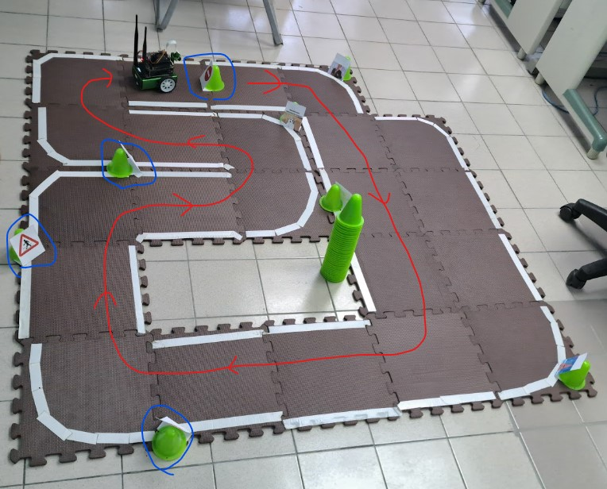
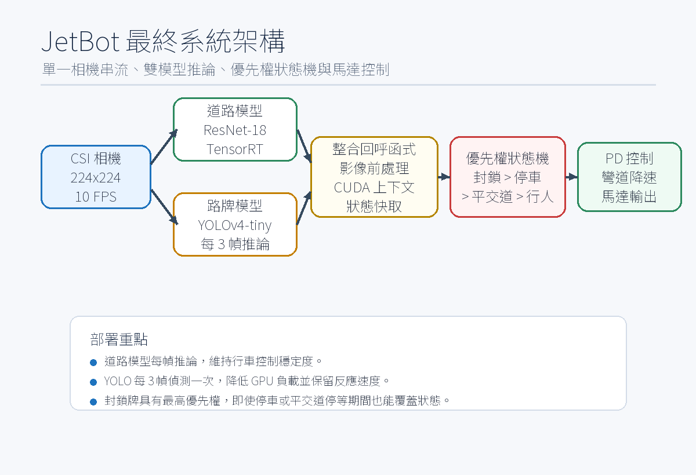
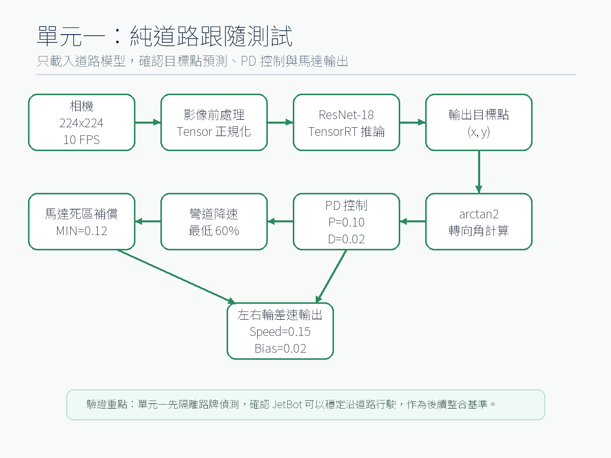
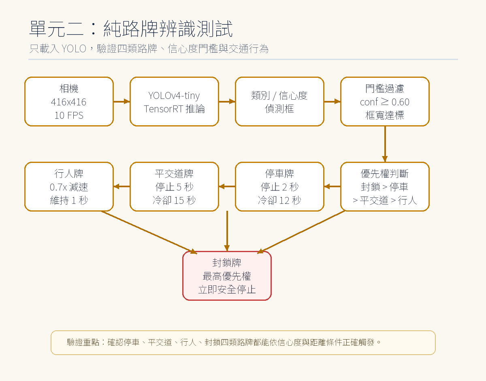
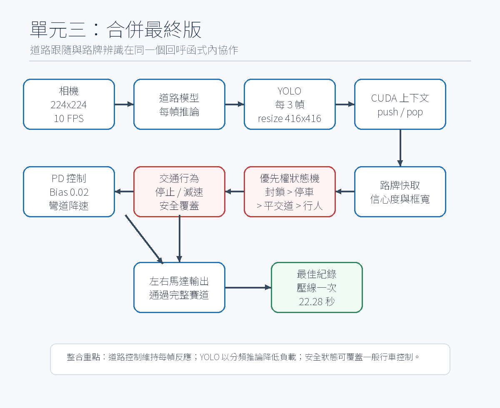
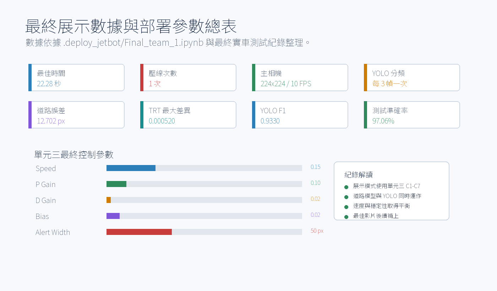
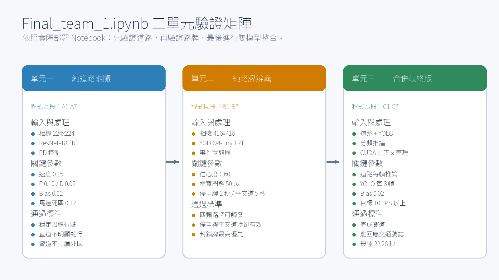
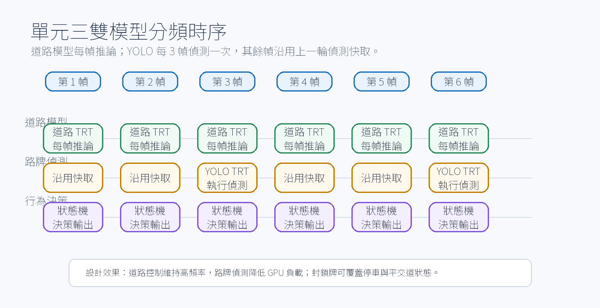
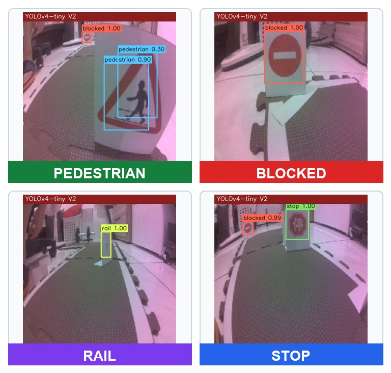
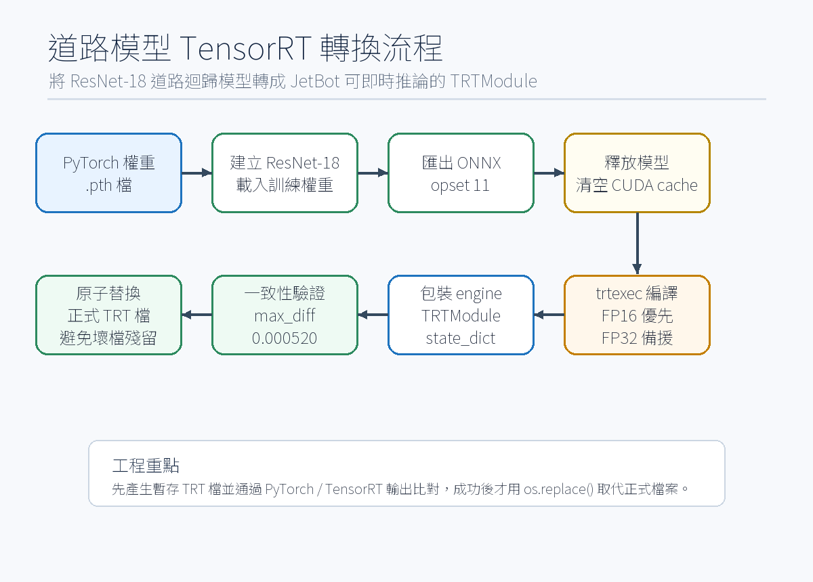

<div align="center">

# 🏎️ JetBot AI 道路循跡與路牌辨識整合專案

**多媒體應用 Final Project — Road Following + Traffic Sign Recognition**


<br /><br />

本專案將 **JetBot 自走車道路循跡**、**YOLOv4-tiny 路牌辨識** 與 **TensorRT 加速推論** 整合成可實際上車運行的最終版本。<br />
主要目標是讓 JetBot 能沿賽道自主行駛，並根據路牌或障礙事件自動停車、減速或恢復巡路。

<br />

**最終實車紀錄：完成時間 22.28 秒**

</div>

---

<details open>
<summary><b>🧑‍🎓 專案團隊 & 課程資訊</b></summary>

<br>

- **指導教授**：陳彥霖 (Yen-Lin Chen), Ph.D.
- **課程單位**：國立臺北科技大學 電資學士班 / Spring 2026
- **專案主題**：JetBot 道路循跡與交通路牌辨識整合
- **組員**：
  - 113820033 電資二 謝奕宏
  - 113820020 電資二 林政德
  - 112820034 電資二 呂伊茹

</details>

<div align="center">

### 🎬 成果精華搶先看

<table width="90%">
  <tr>
    <td align="center" width="50%">
      <b>🏁 最終實車測試紀錄</b><br><br>
      <a href="https://youtube.com/shorts/EyfktqNMqYU?feature=share">
        
      </a>
      <br><br>
      <a href="https://youtube.com/shorts/EyfktqNMqYU?feature=share"><b>觀看最終實車測試影片</b></a><br>
      <sub>https://youtube.com/shorts/EyfktqNMqYU?feature=share</sub><br>
      <sub>最佳時間：22.28 秒。</sub>
    </td>
    <td align="center" width="50%">
      <b>🗺️ 最終賽道路線與系統展示</b><br><br>
      
      <br>
      <sub>最終版本以 .deploy_jetbot/Final_team_1.ipynb 為上車執行入口。</sub>
    </td>
  </tr>
</table>

</div>

---

## 📋 專案簡介

本專案是 Project 5 道路循跡與 Project 6 路牌辨識的最終整合版本。系統會從 JetBot 相機取得影像，分別送入道路模型與路牌模型，再由控制邏輯決定馬達輸出。

| 功能 | 說明 |
|------|------|
| 道路循跡 | 使用 ResNet-18 預測道路目標點 `(X, Y)`，再透過 PD 控制左右輪速度 |
| 路牌辨識 | 使用 YOLOv4-tiny TensorRT 偵測 `stop`、`rail`、`pedestrian`、`blocked` |
| 推論加速 | 道路模型與 YOLO 模型皆整理為 JetBot 可用的 TensorRT 推論版本 |
| 最終整合 | 道路模型持續推論，YOLO 週期性推論，並用事件優先權控制車體狀態 |

<div align="center">
  
  <br>
  <sub>系統架構：相機輸入、道路循跡、路牌辨識、事件判斷與馬達控制。</sub>
</div>

---

## 🧩 Notebook 三個單元

最終主程式位於：

```text
.deploy_jetbot/Final_team_1.ipynb
```

Notebook 不是單一路徑直接跑到底，而是依照測試需求分成三個單元，方便在 JetBot 上逐步驗證。

| 單元 | 名稱 | 重點 |
|------|------|------|
| 單元一 | 道路循跡 | 使用約 800 張實際巡路影像訓練道路模型，測試 JetBot 是否能穩定沿道路行駛 |
| 單元二 | 路牌辨識 | 沿用先前 YOLOv4-tiny 訓練成果，本次整合階段未重新訓練 |
| 單元三 | 最終整合 | 將道路循跡、YOLO 偵測、事件狀態機與馬達控制合併成最終上車流程 |

<div align="center">
  <table width="95%">
    <tr>
      <td align="center" width="33%">
        <br>
        <b>單元一：道路循跡</b>
      </td>
      <td align="center" width="33%">
        <br>
        <b>單元二：路牌辨識</b>
      </td>
      <td align="center" width="33%">
        <br>
        <b>單元三：最終整合</b>
      </td>
    </tr>
  </table>
</div>

---

## 📊 最終成果數據

| 項目 | 結果 |
|------|------|
| 最佳實車紀錄 | **22.28 秒** |
| 道路循跡資料量 | **約 800 張實際巡路影像** |
| 道路模型 | ResNet-18，輸入尺寸 224 x 224 |
| 道路 TensorRT 一致性 | `max_diff = 0.000520` |
| 道路測試平均誤差 | 12.702 px |
| 路牌模型 | YOLOv4-tiny，輸入尺寸 416 x 416 |
| 路牌模型來源 | 沿用 Project 6 訓練成果，本次未額外訓練 |
| YOLO F1-score | 0.9330 |
| YOLO 測試準確率 | 97.06% |
| 最終 Speed | 0.15 |
| 最終 P | 0.10 |
| 最終 D | 0.02 |
| 最終 Bias | 0.02 |

<div align="center">
  <table width="95%">
    <tr>
      <td align="center" width="50%">
        <br>
        <b>最終成果指標</b>
      </td>
      <td align="center" width="50%">
        <br>
        <b>三個單元驗證矩陣</b>
      </td>
    </tr>
  </table>
</div>

---

## 📁 專案結構

```text
Final/
├── .deploy_jetbot/                         # 實際部署到 JetBot 的最終執行包
│   ├── Final_team_1.ipynb                  # 最終主控 Notebook
│   ├── road_following_model/               # 道路循跡模型與 TensorRT 檔案
│   ├── yolo/                               # YOLOv4-tiny 設定、權重與 TensorRT 檔
│   ├── trt_yolv4-tiny-master/              # YOLO TensorRT 推論相關檔案
│   ├── START_HERE.txt                      # JetBot 部署起始說明
│   ├── 使用說明.md                         # JetBot 操作說明
│   └── deploy_structure.md                 # 部署包結構說明
├── road_following_model/                   # 本機道路模型、ONNX 與評估圖
├── road_following_dataset_xy_2026-06-17_08-40-29/
│                                           # 道路循跡資料集
├── images/                                 # 報告與 README 圖片素材
├── docs/                                   # 成果影片與補充文件
├── Final_team_1.ipynb                      # 本機開發版 Notebook
├── 小組報告.md                             # 小組報告 Markdown 原稿
├── 小組報告.docx                           # 小組報告 Word 版本
├── 小組報告.pdf                            # 小組報告 PDF 版本
├── JetBot期末專案_小組報告_第一組.docx      # 最終提交 Word 版本
└── JetBot期末專案_小組報告_第一組.pdf       # 最終提交 PDF 版本
```

---

## 🚀 JetBot 上車流程

實際部署時，請以 `.deploy_jetbot` 內的內容為準，建議放在 JetBot 的專案資料夾：

```text
~/jetbot/notebooks/road_following_team_1/
```

進入 Jupyter Notebook 後開啟：

```text
Final_team_1.ipynb
```

建議測試順序：

1. 確認相機、模型檔、TensorRT plugin 與路徑設定正常。
2. 執行單元一，先確認道路循跡可穩定控制車體。
3. 執行單元二，確認 YOLO 可輸出路牌類別與信心度。
4. 執行單元三，測試道路循跡與路牌辨識的完整整合流程。
5. 切換單元或結束測試前，務必執行停止馬達的 cell。

<div align="center">
  
  <br>
  <sub>單元三執行時序：道路循跡持續執行，YOLO 依週期進行事件辨識。</sub>
</div>

---

## 🧠 模型與控制策略

### 道路循跡模型

- **模型架構**：ResNet-18
- **輸入尺寸**：224 x 224
- **輸出目標**：道路目標點 `(X, Y)`
- **資料來源**：約 800 張 JetBot 實際巡路影像
- **控制方式**：以目標點換算轉向角，再透過 PD 控制馬達速度

```python
angle = atan2(x, y)
pid = angle * P_gain + (angle - angle_last) * D_gain
steering = pid + bias

left_motor  = clamp(speed_gain + steering, 0, 1)
right_motor = clamp(speed_gain - steering, 0, 1)
```

### 路牌辨識模型

- **模型架構**：YOLOv4-tiny
- **輸入尺寸**：416 x 416
- **類別**：`stop`、`rail`、`pedestrian`、`blocked`
- **訓練狀態**：沿用前一階段訓練成果，本次最終整合未重新訓練
- **整合方式**：依信心度、偵測框大小、冷卻時間與狀態優先權決定是否觸發動作

<div align="center">
  <table width="95%">
    <tr>
      <td align="center" width="50%">
        <br>
        <b>道路模型預測視覺化</b>
      </td>
      <td align="center" width="50%">
        <br>
        <b>實際路牌樣本</b>
      </td>
    </tr>
  </table>
</div>

---

## 🔄 TensorRT 轉換

JetBot 採用 Jetson Nano，若直接使用 PyTorch 模型推論，容易造成延遲與控制不穩。因此最終版本將道路模型與 YOLO 模型整理成 TensorRT 可執行版本。

| 模型 | 最終部署檔案 |
|------|------|
| 道路循跡 | `.deploy_jetbot/road_following_model/best_steering_model_xy.engine` |
| 道路循跡備用 | `.deploy_jetbot/road_following_model/best_steering_model_xy_trt.pth` |
| 路牌辨識 | `.deploy_jetbot/yolo/yolov4-tiny-416.trt` |
| YOLO 類別 | `.deploy_jetbot/yolo/obj.names` |

<div align="center">
  
  <br>
  <sub>道路模型 TensorRT 轉換與驗證流程。</sub>
</div>

---

## 🎬 報告與成果展示

| 文件 | 用途 |
|------|------|
| `JetBot期末專案_小組報告_第一組.pdf` | 最終提交 PDF |
| `JetBot期末專案_小組報告_第一組.docx` | 最終提交 Word |
| `小組報告.md` | 小組報告 Markdown 原稿 |
| `.deploy_jetbot/使用說明.md` | JetBot 上車操作說明 |
| `.deploy_jetbot/deploy_structure.md` | 部署包內容說明 |

成果影片與補充資料連結可於報告中的成果展示區更新。

---

## ⚠️ 注意事項

- 第一次執行馬達控制前，建議先將 JetBot 架高測試，避免車體暴衝。
- 切換單元一、單元二、單元三之前，請先停止上一個控制迴圈。
- TensorRT 與 YOLO plugin 必須在 JetBot 上正確載入，否則路牌辨識無法執行。
- 本專案曾遇到 SD 卡損壞與鏡頭模組故障，因此實車測試前應先確認硬體狀態。

---

## 📚 最終定位

這份專案的核心價值在於完成從資料蒐集、模型訓練、TensorRT 加速、Notebook 整合到 JetBot 實車驗證的完整流程。外部讀者可以從本 README 快速理解專案目的，並透過 `.deploy_jetbot/Final_team_1.ipynb` 追蹤最終實際上車版本。
