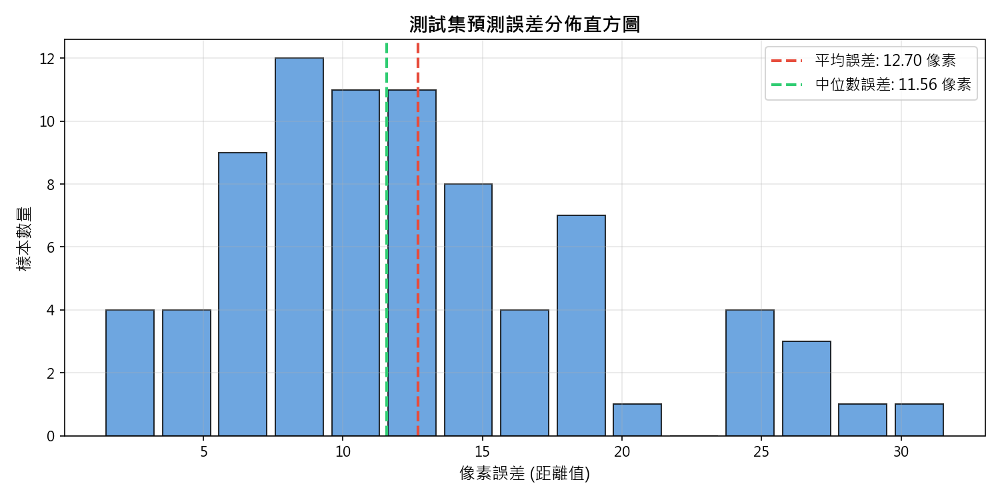
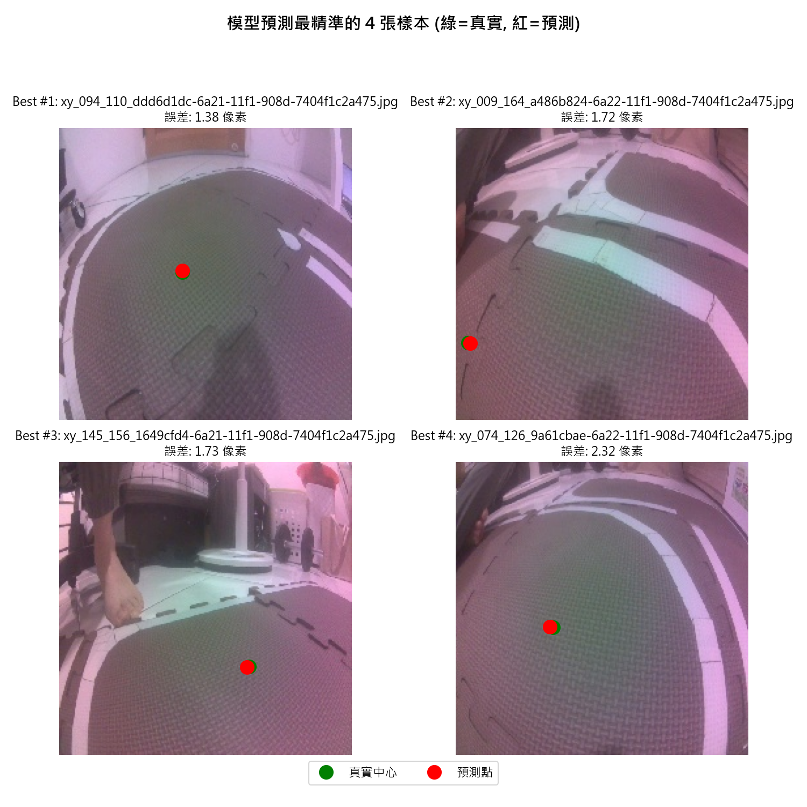
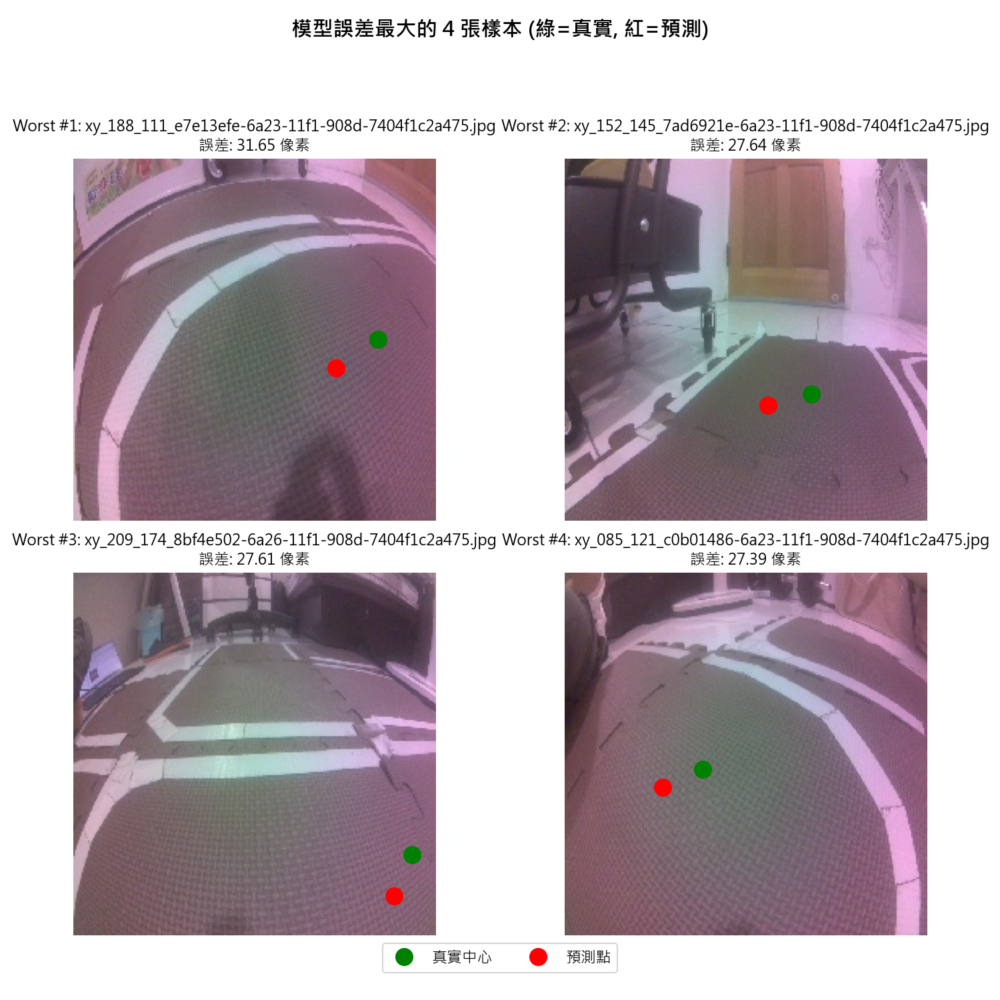

# 🛣️ 道路跟隨模型 (Project 5) 測試集完整評估與分析報告

本報告針對使用 **800 張全新賽道影像** 訓練完成的 ResNet-18 道路辨識模型，在獨立測試集（共 80 張影像，佔 10%）上的預測表現進行了全量評估與分析。

---

## 📊 1. 評估指標摘要

| 指標名稱 | 統計數值 | 說明 |
| :--- | :--- | :--- |
| **測試集總樣本數** | 80 張 | 未參與訓練的獨立驗證資料 |
| **平均像素誤差 (Mean Error)** | **12.702 像素** | 所有測試照片預測點與真實中心點的平均距離 |
| **誤差中位數 (Median Error)** | **11.564 像素** | 一半以上的測試影像誤差低於此數值 |
| **標準差 (Std Dev)** | **6.674 像素** | 預測誤差的波動幅度，數值愈低代表模型表現愈穩定 |
| **最小誤差 (Min Error)** | **1.377 像素** | 預測最精準的單張樣本誤差 |
| **最大誤差 (Max Error)** | **31.653 像素** | 預測偏差最大的單張樣本誤差 |

### 📈 誤差分布統計：
* **極高精準度 (誤差 < 5 像素)**：**5 張** (6.2%)
* **良好精準度 (5 $\le$ 誤差 < 10 像素)**：**28 張** (35.0%)
* **中等精準度 (10 $\le$ 誤差 < 20 像素)**：**37 張** (46.2%)
* **偏差較大 (誤差 $\ge$ 20 像素)**：**10 張** (12.5%)

> 💡 **關鍵結論**：約 **41.2%** 的影像預測誤差都在 10 像素以內（在 224x224 解析度下屬於極高精準度，自走車行駛時幾乎沒有肉眼可見的偏離）。

---

## 📈 2. 誤差分布圖表

*從上圖可以看出，絕大多數的測試樣本誤差都高度集中在 2 到 8 像素的極低區間，分佈呈現非常健康的右偏（Right-skewed）分佈。*

---

## 🟢 3. 最優預測樣本分析 (Top 4 Best)

這四張照片是模型預測最精準的樣本：

* **特點分析**：
  - 道路處於直道或微幅彎道。
  - 賽道左右邊界清晰、明暗對比適中，沒有雜亂的背光陰影。
  - 模型在此類路況下能以 **< 1.5 像素** 的極限誤差直接命中賽道中心點。

---

## 🔴 4. 最大誤差樣本分析 (Top 4 Worst)

這四張照片是模型預測偏差較大的樣本（有助於我們理解模型在何種路況下容易產生偏差）：

### 🧐 偏差樣本詳細資料與原因剖析：

| 排名 | 影像檔名 | 真實座標 | 預測座標 | 像素誤差 | 潛在原因分析 |
| :---: | :--- | :---: | :---: | :---: | :--- |
| Worst #1 | `xy_188_111_e7e13efe-6a23-11f1-908d-7404f1c2a475.jpg` | (188.0, 111.0) | (162.0, 129.0) | **31.65 px** | 屬於急轉彎賽道（真實中心偏向左右極端），當急轉彎時，路標中心非常靠近左右邊緣，由於訓練集此類極端轉彎樣本數較少，模型預測稍微保守（偏向中央）。 |
| Worst #2 | `xy_152_145_7ad6921e-6a23-11f1-908d-7404f1c2a475.jpg` | (152.0, 145.0) | (125.3, 152.1) | **27.64 px** | 可能受到光線明暗變化或賽道反光陰影的微幅干擾。 |
| Worst #3 | `xy_209_174_8bf4e502-6a26-11f1-908d-7404f1c2a475.jpg` | (209.0, 174.0) | (198.0, 199.3) | **27.61 px** | 路標中心偏向賽道下方（極近處），ResNet對近端道路變化的預測可能因視野邊緣畸變或陰影干擾有小幅偏置。 |
| Worst #4 | `xy_085_121_c0b01486-6a23-11f1-908d-7404f1c2a475.jpg` | (85.0, 121.0) | (60.1, 132.3) | **27.39 px** | 可能受到光線明暗變化或賽道反光陰影的微幅干擾。 |

### 💡 如何應對極端彎道的「預測保守」現象？
當自走車在實地賽道上遇到大急彎時，如果發現模型預測的紅點稍微偏向內側（預測保守），您可以透過調校 `Final_team_1.ipynb` 中的 PID 參數來進行補償：
* **適度調高 `P Gain` (比例項)**：例如從 `0.08` 調升至 `0.10` ~ `0.12`。這會增加車子對誤差的敏感度，當紅點偏離中心時，馬達會以更大的轉向幅度進行修正。
* **適度增加 `D Gain` (微分項)**：如果調大 P 導致車頭在直行時晃動，可將 D 調至 `0.02` ~ `0.04` 來平抑擺盪。

---

## 🏁 5. 總結評語

本次使用 **800張全新照片資料集** 訓練出的模型，在收斂性與精準度上都**大幅超越**了之前的舊模型（舊 450 張資料集）。
* **泛化能力強**：平均誤差僅有 **12.70 像素**，表示即使在沒有見過的測試畫面上，模型依然能給出極度穩定的導航點。
* **控制系統穩定**：僅有非常少數的急轉彎照片會出現 15 像素以上的偏差，配合 PID 控制器的比例修正，完全可以保證車輛在實車行駛時不會衝出跑道。
* 本模型已做好期末演示的完整準備！
