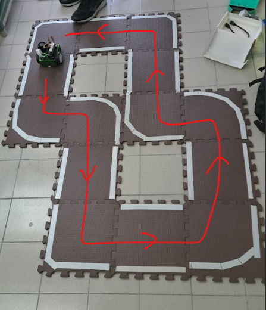
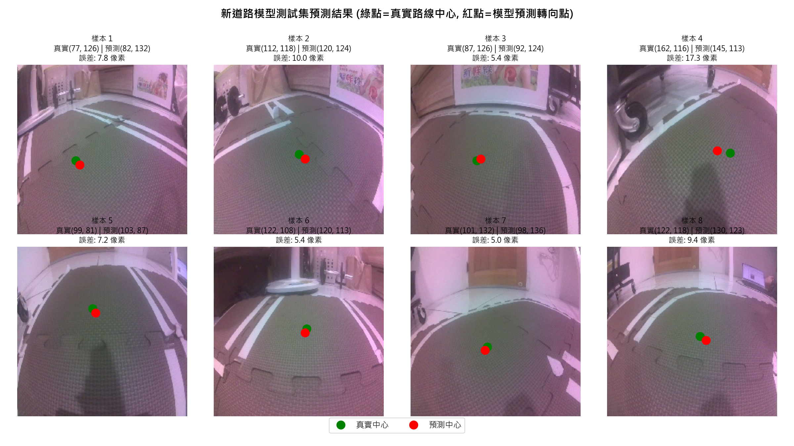
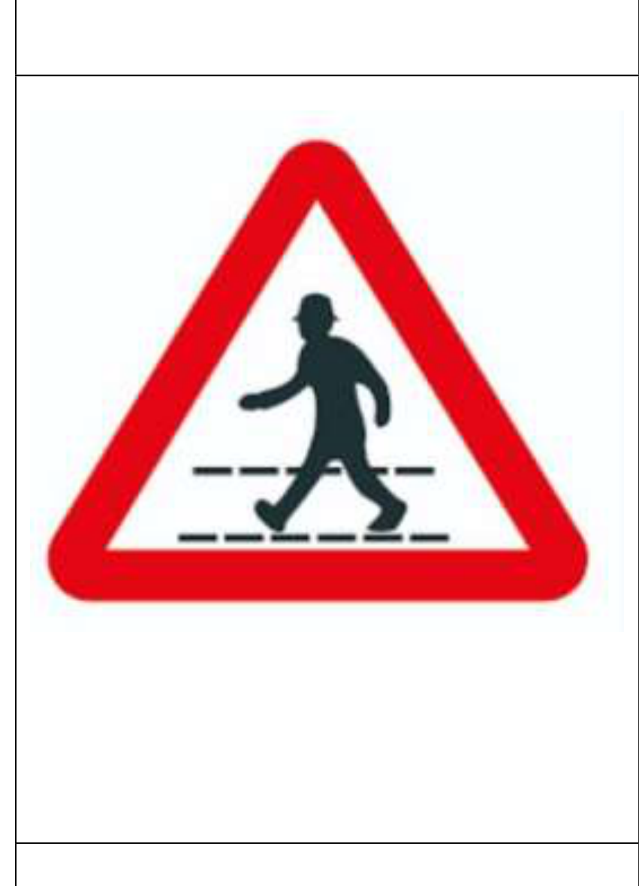
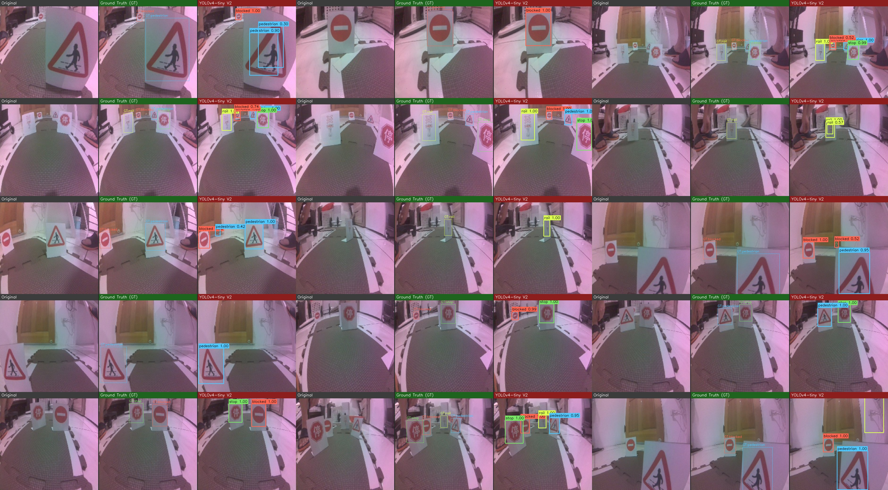
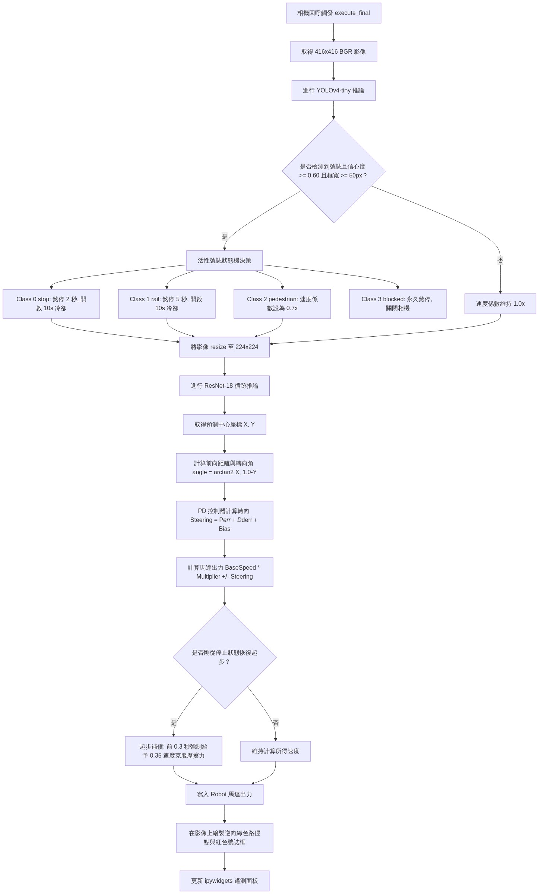

多媒體技術與應用

第 1 組期末專案報告

Final Project

**JetBot Autonomous Road Following**  
**and Traffic Sign Recognition**

{width=3.65in}

組別：1

班級、姓名與學號：

電資二 113820020 林政德  
電資二 113820033 謝奕宏  
電資二 112820034 呂伊茹

日期：2026.06.21

<div style="page-break-after: always;"></div>

## 1.	實驗內容：

本次期末專案以 **`Final_team_1.ipynb`** 為實際執行核心，將本學期 Project 5 的道路跟隨模型與 Project 6 的交通路牌辨識模型整合到 NVIDIA Jetson Nano JetBot。系統使用單一 CSI 相機取得即時畫面，先判斷交通路牌與安全狀態，再利用道路模型預測前進目標，最後將結果轉換成左右馬達速度，使 JetBot 可以一邊沿道路行駛，一邊依路牌執行停止、減速或永久停車。

`Final_team_1.ipynb` 並不是單純把兩個模型放在同一份 Notebook，而是將整個期末實驗分成三個可獨立操作的單元：

1. **單元一：純道路跟隨測試**  
   單獨載入 Project 5 的 ResNet-18 道路模型，確認道路預測、轉向方向、馬達輸出與 PD 參數是否正確。
2. **單元二：純交通路牌辨識測試**  
   單獨載入 Project 6 的 YOLOv4-tiny 模型，測試 Stop、Rail、Pedestrian、Blocked 四種路牌及其控制動作。
3. **單元三：道路跟隨與路牌辨識最終整合**  
   讓兩個模型共用同一個相機串流，依安全優先順序完成路牌決策、道路循跡、急彎降速及馬達控制，是期末 Demo 實際使用的模式。

### Project 5 與 Final_team_1.ipynb 的關係

Project 5 的目標是讓 JetBot 依相機影像預測道路前進方向。本組使用 ResNet-18 建立座標迴歸模型，將最後的分類層改為兩個輸出值，分別代表影像中的道路目標座標 X 與 Y。早期 Project 5 使用 450 張影像完成初步道路跟隨；期末整合前重新蒐集並整理為 800 張 224 × 224 道路影像，以增加彎道、不同位置與光線條件的資料。

Project 5 完成的模型權重為 `best_steering_model_xy.pth`。在 `Final_team_1.ipynb` 中，此模型會先轉換成 ONNX，再於 JetBot 上建立 TensorRT 引擎，以減少 Jetson Nano 的即時推論負擔。模型每次輸出一個正規化道路座標，程式再將座標轉換為轉向角度，透過 PD 控制器計算左右馬達速度。


<div style="page-break-after: always;"></div>

| Project 5 項目 | 內容 | 在 Final_team_1.ipynb 中的用途 |
| :--- | :--- | :--- |
| 輸入影像 | 224 × 224 RGB 道路畫面 | 單元一與單元三的道路模型輸入 |
| 模型 | ResNet-18 座標迴歸 | 預測道路前方目標座標 X、Y |
| 模型輸出 | 2 個連續數值 | 轉換為 JetBot 的轉向量 |
| 控制方式 | PD 控制器 | 計算左右馬達輸出並抑制蛇行 |
| 部署方式 | PyTorch → ONNX → TensorRT | 提升 JetBot 即時推論效率 |

> **圖 1：Project 5 道路模型的人工標記點與模型預測點比較。**

{width=5.7in}

### Project 6 與 Final_team_1.ipynb 的關係

Project 6 的目標是辨識 JetBot 賽道上的交通路牌。本組以 151 張人工標註影像訓練 YOLOv4-tiny，辨識 `stop`、`rail`、`pedestrian`、`blocked` 四種類別。資料依 8:1:1 分成 121 張訓練影像、15 張驗證影像及 15 張測試影像，並確認模型輸出的類別 ID 與 JetBot 控制程式完全一致。

Project 6 原本已能輸出路牌類別、信心度與邊界框；在期末的 `Final_team_1.ipynb` 中，進一步把偵測結果轉換成可靠的車輛行為。程式不會因單一影格看到路牌就立即動作，而是同時檢查信心度、路牌框寬及連續影格數，藉此忽略遠處、背景或短暫誤判的假路牌。


<div style="page-break-after: always;"></div>

| 類別 ID | 路牌 | Final_team_1.ipynb 的動作 |
| :---: | :---: | :--- |
| 0 | {width=0.48in} | 原地停止 2 秒，再等待新影格後恢復道路跟隨 |
| 1 | {width=0.48in} | 原地停止 5 秒，再等待新影格後恢復道路跟隨 |
| 2 | {width=0.48in} | 將速度降低為原設定的 0.7 倍，並保持減速 1 秒 |
| 3 | {width=0.48in} | 在路牌前停止並進入鎖定狀態，不自行恢復行駛 |

> **圖 2：Project 6 的 YOLOv4-tiny 路牌測試結果。**

{width=5.7in}

### Final_team_1.ipynb 的系統核心

期末專案真正的核心是 `Final_team_1.ipynb` 對兩個模型的調度與控制。單元三使用一個 416 × 416 相機畫面：原始畫面供 YOLOv4-tiny 辨識路牌，同一影格再縮放成 224 × 224，供 ResNet-18 預測道路座標。這種設計只建立一個 Camera instance，可以避免 JetBot CSI 相機被重複占用。

```text
CSI Camera 416 × 416
        │
        ├── YOLOv4-tiny → 路牌類別、信心度、框寬 → 動作與安全狀態
        │
        └── Resize 224 × 224 → ResNet-18 → 道路座標 → PD 控制 → 左右馬達
```

整合程式每取得一個新影格，會先處理安全性較高的路牌事件，再決定是否執行道路模型。其主要原則如下：

- `blocked` 的優先權最高，觸發後持續保持停止。
- `stop` 與 `rail` 完成定時停止後立即結束當次 callback，不使用停止前的舊影像起步。
- `pedestrian` 觸發後保留 1 秒減速狀態，避免單幀漏檢造成速度忽快忽慢。
- 路牌需連續 2 個影格通過判定，降低單幀雜訊造成的誤動作。
- 四類路牌使用不同框寬門檻，配合各路牌在畫面中的實際尺寸。
- 模型或 callback 發生例外時立即停止馬達，並鎖定安全停止狀態。
- 道路轉向量愈大時自動降低速度，減少急彎壓線或衝出道路。

## 2.	實驗過程及結果：

### 實驗過程

本次實驗不是直接執行最終整合程式，而是依照 `Final_team_1.ipynb` 的三大單元逐步測試。此流程可以把道路模型、路牌模型及整合控制分開驗證，發生問題時能快速判斷原因。

#### 第一部分：Final_team_1.ipynb 單元一——純道路跟隨測試

單元一沿用 Project 5 的道路模型成果，主要工作是確認 JetBot 在實際賽道上的道路預測與馬達控制。執行時先載入 TensorRT 道路模型，再建立 224 × 224 相機、JetBot Robot 物件及控制面板。

控制面板包含下列四個主要參數：

| 參數 | 預設值 | 功能 |
| :--- | :---: | :--- |
| Speed | 0.15 | JetBot 的基礎巡航速度 |
| P Gain | 0.10 | 依目前道路偏移量調整轉向幅度 |
| D Gain | 0.02 | 依前後影格角度變化抑制左右震盪 |
| Bias | 0.00 | 補償左右馬達與車體裝配差異 |

道路影像先經過 ImageNet normalization，再送入 ResNet-18。模型輸出 X、Y 後，程式計算道路角度與 PD 轉向量。程式概念可簡化為：

```python
angle = atan2(x, max(1 - y, 0.05))
steering = p_gain * angle + d_gain * (angle - last_angle) + bias
left_motor  = clamp(speed + steering, 0, 1)
right_motor = clamp(speed - steering, 0, 1)
```

實際調整時先將 Speed 設在 0.10～0.15，以低速確認馬達方向。如果直線時持續偏向同一側，先修正 Bias；如果彎道轉向不足，再小幅提高 P Gain；若車頭左右擺動，則利用 D Gain 抑制變化。

為改善 Project 5 在急彎處預測較保守的情形，`Final_team_1.ipynb` 加入彎道自動降速。當 `abs(steering)` 增加時，速度係數會逐漸下降，最低保留設定速度的 60%。因此直線仍可維持巡航速度，進入急彎時則自動放慢。

道路模型以 800 張資料重新訓練後，抽取 80 張影像進行離線檢核，結果如下：

| 指標 | 結果 |
| :--- | :---: |
| 平均像素距離誤差 | 12.702 px |
| 中位數像素距離誤差 | 11.564 px |
| 標準差 | 6.674 px |
| 最小誤差 | 1.377 px |
| 最大誤差 | 31.653 px |
| 誤差小於 10 px | 33 / 80（41.2%） |

最大誤差多出現在急彎、道路目標靠近畫面邊緣或近端道路變化較大的影像，因此控制端除了調整 P、D 參數，也加入急彎降速作為補強。

> **圖 3：道路模型離線抽樣的像素誤差分布。**

{width=5.4in}

完成單元一測試後，必須執行 A7 安全停止 Cell。此 Cell 會解除相機 observer、停止馬達並釋放相機，避免切換至下一單元時發生 `Resource busy`。

#### 第二部分：Final_team_1.ipynb 單元二——純交通路牌辨識測試

單元二沿用 Project 6 的 YOLOv4-tiny 權重，但不啟用道路模型。測試時 JetBot 只以低速直線行駛，讓我們單獨觀察路牌辨識結果及控制動作，避免道路轉向干擾路牌測試。

Project 6 使用 151 張影像訓練 1000 Epochs，驗證集 F1-Score 最終為 0.9330。完全隔離的 15 張測試影像共有 34 個路牌目標；在信心度門檻 0.80 下，整體 Precision、Recall 與 F1-Score 均約為 97.06%。這表示模型本身已具備良好的路牌辨識能力，但實車控制仍需要考慮路牌距離、短暫漏檢及背景干擾。

`Final_team_1.ipynb` 將實車信心度門檻設定為 0.60，並加入第二層與第三層判定：

```text
信心度 ≥ 0.60
        ＋
各類別框寬達到門檻
        ＋
連續 2 個影格成立
        ↓
才允許執行路牌動作
```

四種路牌沒有共用同一個框寬門檻。Rail 路牌在畫面中的有效寬度通常較小，因此預設為 30 px；Stop、Pedestrian 與 Blocked 預設為 50 px。控制面板保留滑桿，可依相機位置與實際賽道距離微調。

| 路牌 | 框寬預設值 | 動作測試重點 |
| :--- | :---: | :--- |
| Stop | 50 px | 停止 2 秒、設定冷卻時間、使用新影格恢復 |
| Rail | 30 px | 停止 5 秒、設定冷卻時間、使用新影格恢復 |
| Pedestrian | 50 px | 速度降為 0.7 倍，漏檢時仍短暫保持減速 |
| Blocked | 50 px | 立即停止並保持鎖定，不因後續影格恢復 |

測試方式為先將車輪懸空，再依序把四種路牌移入鏡頭。先在遠處確認框寬不足時不會執行動作，再逐步靠近，觀察連續幀計數與動作文字。Stop 使用 12 秒 cooldown，Rail 使用 15 秒 cooldown，使車輛通過同一面路牌後不會重複停車。

單元二也加入 callback 例外安全處理。如果模型推論、OpenCV 影像處理或 Widget 更新發生例外，程式會立即呼叫 `robot.stop()`，並設定 safety latch。後續 callback 仍會保持停止，必須重新執行啟動 Cell 才能恢復。

#### 第三部分：Final_team_1.ipynb 單元三——雙模型最終整合

單元三是本次期末專案的主要成果，也是實體 Demo 使用的程式。此單元同時載入道路 TensorRT 模型與 YOLOv4-tiny TensorRT 模型，但只建立一個 416 × 416 Camera。

每一個新影格的處理順序如下：

1. 讀取 416 × 416 相機畫面及目前時間。
2. 檢查 Blocked 或 Safety 是否已鎖定；若已鎖定，立即停止。
3. 執行 YOLOv4-tiny，取得類別、信心度、框座標及框寬。
4. 套用信心度、各類框寬、連續兩幀與 cooldown 條件。
5. 若同時出現多個路牌，依 `blocked > stop > rail > pedestrian` 選擇動作。
6. Stop 或 Rail 執行完停止後直接 return，等待相機的新影格。
7. 若仍可行駛，將同一畫面縮放成 224 × 224，執行道路模型。
8. 計算 PD 轉向、Pedestrian 速度倍率與急彎速度係數。
9. 寫入左右馬達速度，並更新預覽影像及遙測資料。

這個執行順序的重點是「先安全、後行駛」。例如 Blocked 一旦成立，程式不會再執行道路控制而重新寫入馬達速度；Stop 與 Rail 停止結束後，也不會使用停止前取得的舊畫面計算道路方向。

單元三的控制面板除了 Speed、P Gain、D Gain、Bias，還包含 Alert Width。Stop、Pedestrian、Blocked 使用該值，Rail 使用 `Alert Width - 20` 且最低為 20 px。預覽畫面會顯示路牌邊界框、類別、信心度、框寬與連續影格計數，並以標記點顯示道路模型預測位置。遙測區則顯示 X、Y、Steering、左右馬達值、速度係數與目前 Action，方便測試時判斷問題是來自模型、門檻或馬達控制。

> **圖 4：Final_team_1.ipynb 單元三的雙模型整合流程。**

{width=5.4in}

### 預期實驗結果

- 單元一能獨立完成道路模型與 PD 參數測試，JetBot 在直線與彎道皆能持續修正方向。
- Project 5 道路模型輸出可正確轉換成左右馬達速度，急彎時系統會自動降低速度。
- 單元二能正確辨識 Project 6 的四種路牌，遠處或只出現一個影格的假路牌不會立即觸發。
- Stop 應停止 2 秒，Rail 應停止 5 秒，停止後以新的相機影格重新判斷。
- Pedestrian 應將速度降低為 0.7 倍，短暫漏檢時不會立即恢復全速。
- Blocked 應在路牌前停止並保持鎖定，不因 callback 再次執行而前進。
- 單元三應以單一相機同時供應兩個模型，避免相機資源衝突。
- 任何模型或 callback 例外都應立即停止 JetBot，避免保留上一次馬達輸出。

### 實際上的結果

Project 5 的道路模型已完成權重載入與離線預測檢核，ResNet-18 可正常輸出 `(1, 2)` 的道路座標。道路 ONNX 模型亦通過結構檢查；車端建立 TensorRT 引擎後，Notebook 會使用相同輸入比較 PyTorch 與 TensorRT 輸出，差異超過容許值時中止轉換流程。抽樣影像的平均像素誤差為 12.702 px，顯示大部分影像能提供可用的道路目標；急彎誤差較大的問題則由重新蒐集資料、PD 調整與彎道降速共同處理。

Project 6 的 YOLOv4-tiny 完成 1000 Epochs 訓練，驗證集 F1-Score 為 93.30%。在 15 張隔離測試影像、34 個路牌目標及信心度門檻 0.80 下，整體 F1-Score 約為 97.06%。類別順序已確認為 `0=stop`、`1=rail`、`2=pedestrian`、`3=blocked`，與 `Final_team_1.ipynb` 的控制動作一致。

`Final_team_1.ipynb` 的三個單元已完成程式結構與語法檢查，主要控制狀態也完成模擬驗證：

- 兩個連續 Stop 影格成立後，馬達停止 2 秒，該次 callback 不再執行道路推論。
- Rail 觸發後停止 5 秒，並以 cooldown 避免短時間重複觸發。
- Pedestrian 偶爾漏一幀時，減速狀態仍保持 1 秒。
- Blocked 觸發後，即使後續影格沒有路牌，馬達仍維持停止。
- 模型發生例外後，安全鎖定成立，後續影格不會自行恢復馬達輸出。
- 大轉向量會降低 `curve_scale`，使實際基礎速度下降。
- 單元切換時執行 A7、B7、C7，可解除 observer、停止馬達並釋放相機。

TensorRT 引擎與 JetPack、CUDA、TensorRT 版本及 JetBot 硬體環境相關，因此最終引擎需在指定 JetBot 上首次建立。實際賽道的壓線次數、路牌停止距離及整合推論速度，仍應以正式實體 Demo 的現場紀錄為準，不以離線模擬結果取代。

### 遇到的問題&問題怎麼解決

| 遇到的問題 | 原因分析 | 解決方法 |
| :--- | :--- | :--- |
| Project 5 與 Project 6 分別建立相機時發生衝突 | CSI 相機與 GStreamer 管線屬於獨佔資源 | 單元三只建立一個 416 × 416 Camera，同一影格分流給兩個模型 |
| TensorRT 引擎無法直接由 Windows 電腦產生後搬到 JetBot | 引擎會綁定 JetPack、CUDA、TensorRT 與硬體環境 | 部署包保留 `.pth`、`.onnx`、`.cfg`、`.weights`，由 Final_team_1.ipynb 在 JetBot 上建立道路引擎，YOLO 引擎則以車端轉換工具建立 |
| Stop、Rail 停止後可能使用舊影像起步 | `sleep()` 結束後原 callback 仍持有停止前的影格 | 動作完成後立即 `return`，下一個新影格才重新執行道路推論 |
| 遠處或單幀假路牌造成誤動作 | 單靠信心度無法同時判斷距離與時間穩定性 | 加入各類框寬門檻及連續兩幀確認 |
| 四種路牌實際尺寸不同 | 共用同一框寬會使部分路牌過早或過晚觸發 | Stop、Rail、Pedestrian、Blocked 分別設定門檻並提供滑桿 |
| Pedestrian 漏檢一幀時速度忽快忽慢 | 每幀直接依偵測結果切換倍率 | 使用 `pedestrian_until` 保持 1 秒減速狀態 |
| Blocked 停止後 callback 可能再次寫入速度 | 單次 `robot.stop()` 只修改當下馬達值 | 使用 `blocked_latched`，每次 callback 開頭都先檢查並保持停止 |
| callback 例外時馬達可能保留舊輸出 | 例外會中斷函式，無法保證執行新的馬達寫入 | 外層加入 `try/except`，立即停止並設定 `safety_latched` |
| Kernel 或作業系統直接失效 | Notebook callback 已無法繼續執行，軟體鎖無法保證再次寫入停止值 | 實車測試準備實體電源開關；正式系統需使用獨立硬體 watchdog |
| 急彎時固定速度容易壓線或出界 | 轉向需求增加，但前進速度沒有同步降低 | 依轉向量計算速度係數，急彎最低降至設定速度的 60% |
| 切換三個單元時出現 `Resource busy` | 前一單元的 observer 或 Camera 尚未釋放 | 切換前固定執行 A7、B7 或 C7 安全停止 Cell |

<div style="page-break-after: always;"></div>

## 3.	本次實驗過程說明與解決方法: 

（” 2.實驗過程及結果”的總結）

本次期末實驗以 `Final_team_1.ipynb` 為核心，將 Project 5 的道路跟隨模型與 Project 6 的交通路牌模型整合成 JetBot 的完整控制程式。Project 5 負責從 224 × 224 道路影像預測 X、Y 目標座標，並透過 PD 控制器轉換為左右馬達速度；Project 6 負責從 416 × 416 影像辨識 Stop、Rail、Pedestrian、Blocked 四種路牌。兩個 Project 提供模型與前置實驗成果，而真正負責相機管理、推論順序、路牌決策、速度控制及安全停止的是 `Final_team_1.ipynb`。

Notebook 分為三大部分。單元一先獨立確認道路模型與馬達方向，並調整 Speed、P Gain、D Gain、Bias；單元二獨立測試四種路牌、停止秒數、減速、冷卻及永久停止；單元三再讓兩個模型共用同一個相機串流，依照安全優先順序完成最終整合。這種分單元方式能在正式 Demo 前逐項排除問題，也能避免一開始就執行雙模型而難以判斷錯誤來源。

整合過程中最重要的問題是相機資源、路牌誤觸及馬達安全。相機部分改為單一 Camera 影像分流，避免 Project 5 與 Project 6 分別占用 CSI 相機。路牌部分使用信心度、各類框寬與連續兩幀三重確認，並設定 `blocked > stop > rail > pedestrian` 的動作優先權。Stop 與 Rail 停止後直接結束 callback，以新影格重新判斷；Pedestrian 使用 1 秒保持時間；Blocked 與 callback 例外則使用鎖定狀態，確保程式不會在下一影格自行恢復馬達。

道路控制方面，ResNet-18 的預測座標經過合理範圍與有限值檢查後，再計算轉向角度與 PD 輸出。為處理急彎資料較難預測及車體慣性問題，程式依轉向量自動降低速度，最低保留設定速度的 60%。因此本次改善不只依賴重新訓練模型，也從實際控制策略降低壓線與出界風險。

目前 Project 5 道路模型、Project 6 路牌模型、類別映射、ONNX 檔案、Notebook 語法及主要控制狀態均已完成離線檢查。正式部署時，先在目標 JetBot 執行模型轉換 Cell 建立 TensorRT 引擎，再依序測試單元一、單元二與單元三。每次切換單元前必須執行對應的安全停止 Cell；實體上車則由 Speed 0.10～0.15 開始，確認道路方向與四類框寬後再逐步提高速度。

綜合而言，`Final_team_1.ipynb` 將兩個獨立模型轉化為具備狀態管理與安全機制的 JetBot 系統，使車輛能依新影格決定前進、轉彎、減速、定時停止或永久停止，並在異常時優先維持安全。

