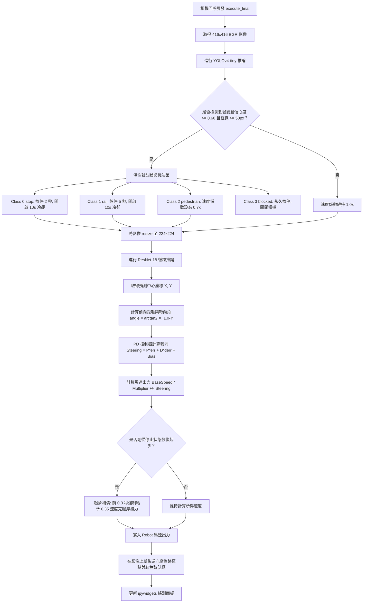
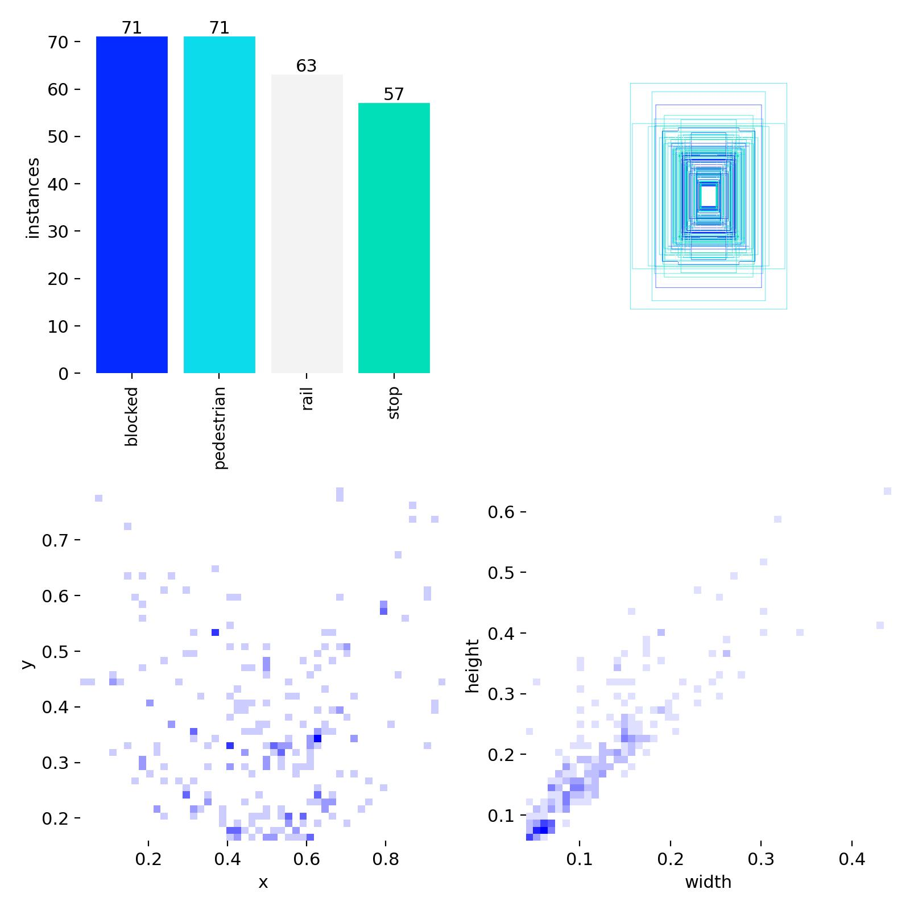
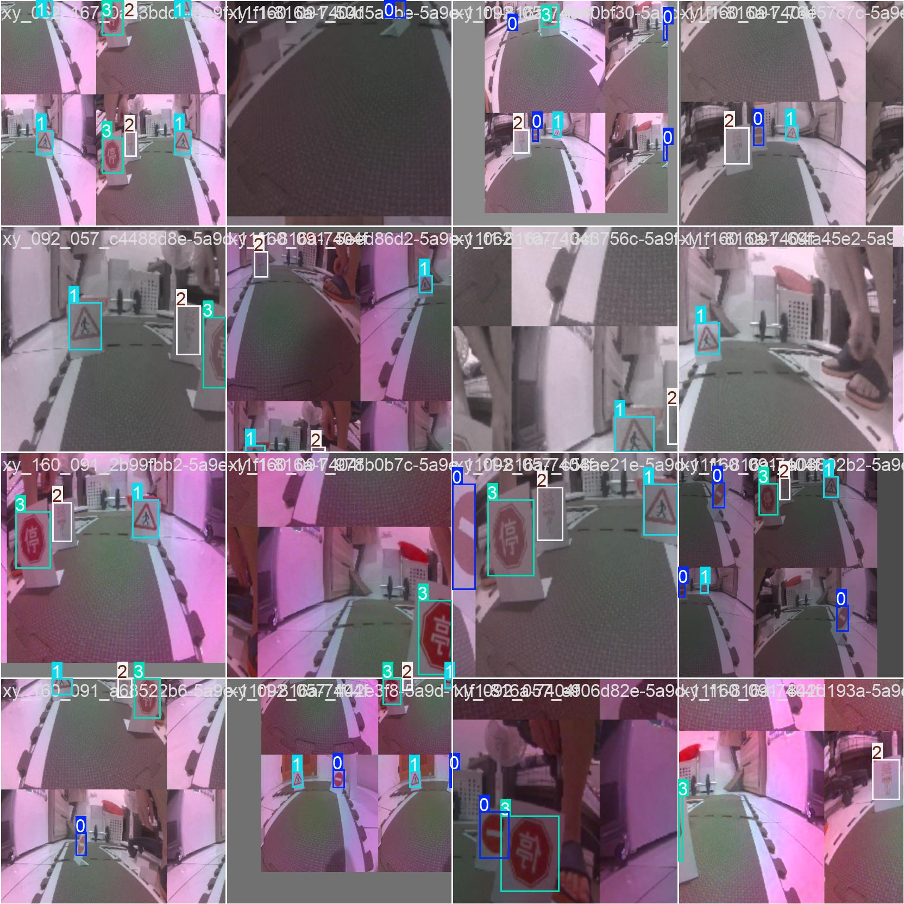
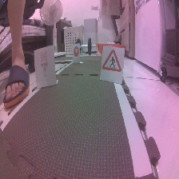
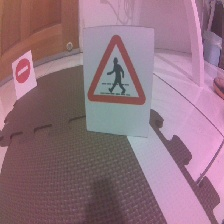
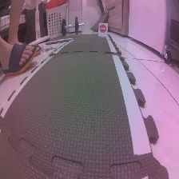
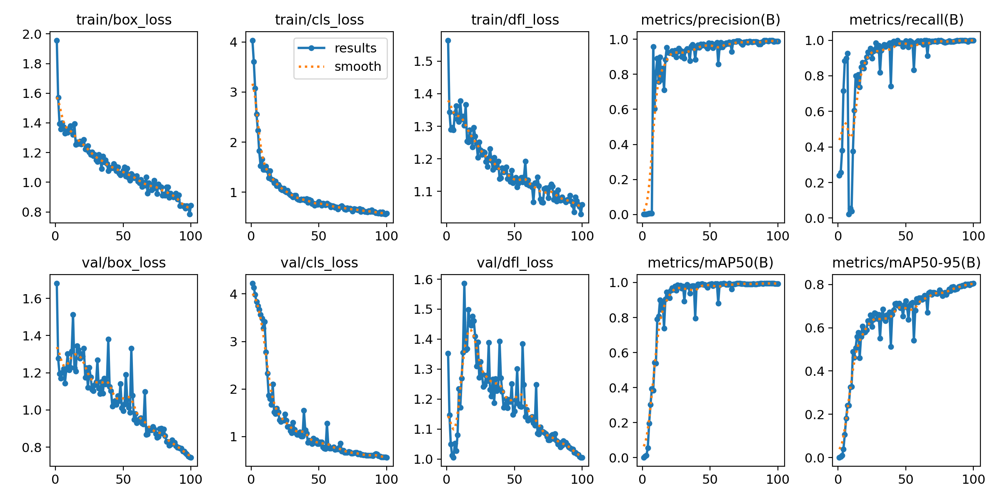
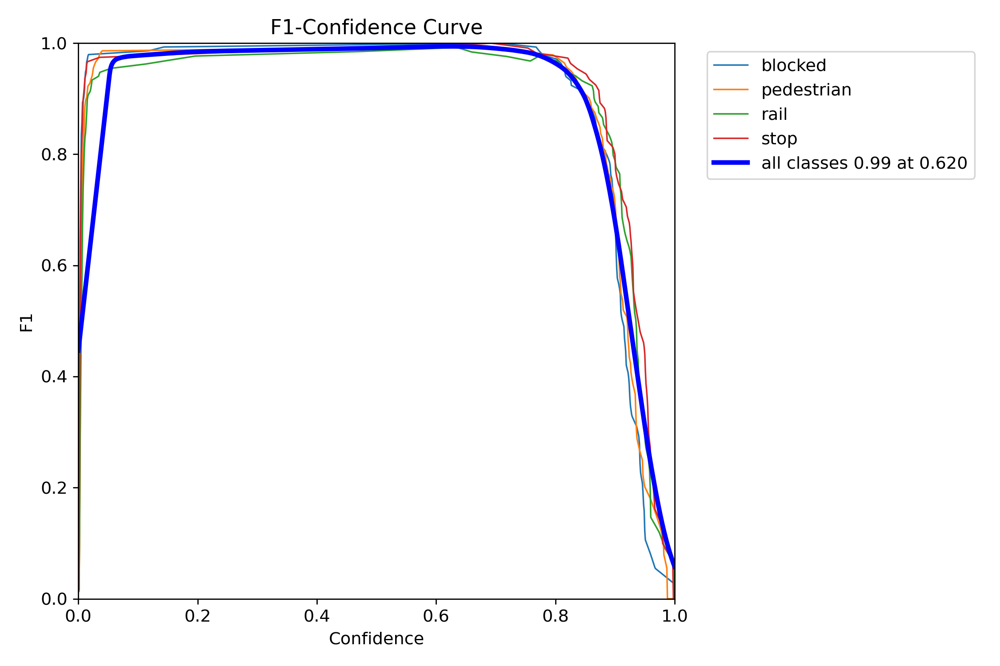
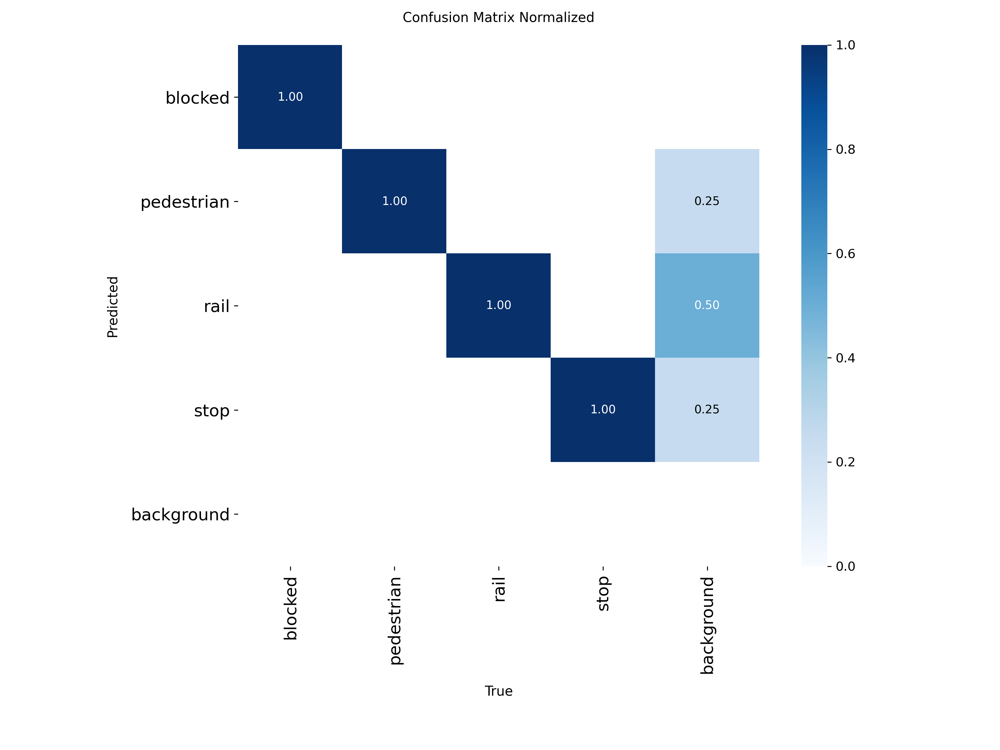
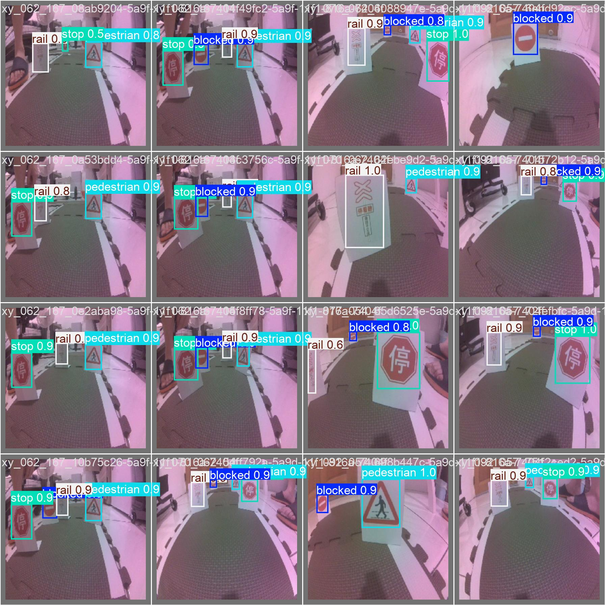

多媒體技術與應用  
第 1 組專案報告  
期末整合專案  
以 Final.ipynb 為核心之 JetBot 雙模型自主駕駛控制系統  

組別： 1  
班級、姓名與學號：  
電資二 113820020 林政德  
電資二 113820033 謝奕宏  
電資二 112820034 呂伊茹  
指導教授：陳彥霖 (Yen-Lin Chen), Ph.D.  
學校：國立臺北科技大學 電資學士班  
日期：2026.06.20  

```{=openxml}
<w:p><w:r><w:br w:type="page"/></w:r></w:p>
```


## 1.	實驗內容：

本期末整合專案的核心目標是建構一套在資源受限嵌入式硬體 NVIDIA Jetson Nano (4GB) 上能即時運行的自主無人駕駛系統。整個系統的開發、部署、調試與最終驗收完全以合併控制程式 **`Final.ipynb`** 為核心。透過同時載入雙 TensorRT (FP16) 最佳化加速模型，實現高畫質、低延遲的道路跟隨（Road Following）與交通號誌辨識（Traffic Sign Detection）並行推論與狀態決策。

### 1.1 `Final.ipynb` 的系統行為指標
自走車以車載相機為唯一感測來源，接收 CSI 相機影像流後並行進行兩種 AI 模型的推論，並依號誌大小與類別做出對應動作控制：
* **道路跟隨循跡**：沿著跑道中心線平穩行駛，轉向修正及時，左右車輪輪胎在直道與連續彎道中不得壓線或衝出賽道。
* **當心行人 (pedestrian / Class 2)**：偵測到行人路牌且其邊界框寬度達到設定門檻時，車速自動減速至基礎設定值的 **0.7 倍**；當號誌離開視線後，自走車平滑恢復原巡航速度。
* **停車再開 (stop / Class 0)**：偵測到停止路牌且寬度達到門檻時，自走車於原地**完全停止 2 秒**，隨後重新起步前進。
* **鐵路平交道 (rail / Class 1)**：偵測到平交道號誌且寬度達到門檻時，於原地**完全停止 5 秒**，隨後重新起步前進。
* **道路封閉 (blocked / Class 3)**：偵測到阻礙路標且寬度達到門檻時，自走車**立即永久煞停**，並釋放相機與馬達控制權，且停止前車頭不得超越路牌位置。
* **防假路標與雜訊過濾**：設定置信度 (Confidence Score) 與偵測框寬度 (Width) 門檻，忽略遠處無關號誌或賽道旁的背景雜物（如賽道旁的假號誌貼紙），防止自走車提早誤煞車。

| 號誌名稱 | 類別 ID | 號誌實物圖 | 號誌說明 | JetBot 對應動作 |
| :---: | :---: | :---: | :--- | :--- |
| `stop` | **0** | {width=0.5in} | 停車再開 (八角形紅色路牌) | 原地停止 **2 秒**，隨後恢復行駛 |
| `rail` | **1** | {width=0.5in} | 鐵路平交道 (停看聽黃色圓牌) | 原地停止 **5 秒**，隨後恢復行駛 |
| `pedestrian` | **2** | {width=0.5in} | 當心行人 (三角形黃底路牌) | 巡航車速**調降為 0.7x**，駛離後恢復 |
| `blocked` | **3** | {width=0.5in} | 道路封閉 (圓形紅色禁止進入) | **永久煞停**，停止相機與控制迴圈 |

---

### 1.2 `Final.ipynb` 載入之雙模型規格與配置
為了在 Jetson Nano 限制的 VRAM (4GB) 內流暢執行雙模型，我們將兩大深度學習模型全部編譯為 TensorRT 引擎並以 FP16 半精度加速：

| 模型名稱 | 骨幹架構 | 任務類型 | 輸入影像規格 | 輸出張量格式 | 部署加速格式 |
| :--- | :--- | :--- | :--- | :--- | :--- |
| **道路循跡模型** | ResNet-18 | 座標迴歸 (Regression) | 224 × 224 (RGB) | 中心座標 X, Y (範圍為 -1.0 至 1.0) | TensorRT FP16 (`TRTModule`) |
| **交通號誌辨識** | YOLOv4-tiny | 目標偵測 (Detection) | 416 × 416 (RGB) | 邊界框、信心度、4類類別ID | TensorRT FP16 (PyCUDA 加速) |

#### A. 道路循跡模型 (ResNet-18 Regression Model)
* **神經網路架構**：以預訓練的 ResNet-18 為特徵提取器，最後的全連接層修改為 `Linear(512, 2)`。
* **資料與規格**：本專案不使用舊的 Project 5 資料集，而是**針對整合賽道重新收集了 800 張全新照片進行訓練**。輸入為 224x224 RGB 影像，輸出為代表道路前進中心點的座標 (X, Y)，範圍介於 -1.0 至 1.0 之間。

#### B. 交通號誌辨識模型 (YOLOv4-tiny Object Detection Model)
* **神經網路架構**：YOLOv4-tiny（包含 3 個 YOLO 偵測頭與輕量化 CSPDarknet53 骨幹）。
* **資料與規格**：輸入為 416x416 RGB 影像，輸出為號誌的邊界框座標 `(x_min, y_min, x_max, y_max)`、置信度 `Confidence` 與類別 ID `0(stop), 1(rail), 2(pedestrian), 3(blocked)`。

```{=openxml}
<w:p><w:r><w:br w:type="page"/></w:r></w:p>
```

### 1.3 `Final.ipynb` 雙模型合併與影像分流流程
在 Jetson Nano 底層中，CSI 相機管線（GStreamer 的 `nvarguscamerasrc` 模組）屬於獨佔資源，無法同時被兩個模型或兩個獨立的相機實例開啟。如果分別載入兩套程式，會直接觸發 `Resource busy` 導致相機死鎖。

為了徹底解決此瓶頸，`Final.ipynb` 在單元三中設計了**單一相機執行個體 (Camera Instance) 的雙模型影像分流流程**：

```text
[Camera.instance() 輸出 416x416 BGR 影格]
          │
          ├───► [分流 A：原圖直接輸入] ──► YOLOv4-tiny TRT ──► 預測號誌邊界框與類別
          │
          └───► [分流 B：影像預處理]
                      │
                      ├──► OpenCV resize 至 224x224
                      ├──► BGR 轉 RGB 並調換通道至 CHW
                      ├──► ImageNet 正規化與 FP16 轉型
                      └──► 輸入 ResNet-18 TRT ──► 預測道路 X, Y 座標
```

本專案的核心合併邏輯與流程控制實作於 `execute_final(change)` 回呼函式中，其詳細運算步驟如下：



---

## 2.	實驗過程及結果：

### 2.1 實驗過程

整個專案的實驗過程完全圍繞著 `Final.ipynb` 程式的開發、TensorRT 優化編譯、分步調參數與最終合併運作展開。

#### Step 1：道路循跡模型開發 (ResNet-18)
1. **全新資料集收集**：為了適應整合賽道上擺放實體號誌後的複雜環境（背景雜訊增加，且相機視角可能被號誌卡片部分遮擋），我們**重新收集了 800 張全新影像**。使用 Gamepad 手把搖桿控制 `data_collection_gamepad.ipynb`，人工標定綠點代表自走車應該前往的道路中心，檔名保存為 `xy_{X}_{Y}_{uuid}.jpg`。
2. **自訂 Dataset 解析與增強**：在訓練腳本（`train_model.ipynb`）中，我們編寫了 `XYDataset` 類別，在載入圖片時從檔名中解析 `X` 與 `Y` 標記座標值，並正規化至 `[-1, 1]`。為了提升泛化力，在訓練集上套用了隨機水平翻轉（當影像翻轉時，標籤 `x` 座標同步取負號）與 HSV 色彩抖動。
3. **模型訓練配置**：在本地 PC 端上，我們使用 PyTorch 載入 ResNet-18 預訓練權重，修改全連接層輸出為 2，以下為我們採用的訓練參數：

| 訓練參數 | 設定值 | 說明 |
| :--- | :--- | :--- |
| **模型骨幹** | ResNet-18 (Pretrained) | 載入 ImageNet 權重進行遷移學習 |
| **損失函數** | MSE Loss | 評估預測座標與真實座標的均方誤差 |
| **最佳化器** | Adam Optimizer | 學習率 0.001 (1e-3)，Weight Decay 0.0001 (1e-4) |
| **排程器** | ReduceLROnPlateau | 若連續 10 輪驗證損失未下降則學習率減半 |
| **訓練週期** | 100 Epochs | 批次大小 (Batch Size) 設為 16 |

#### Step 2：交通號誌辨識模型開發 (YOLOv4-tiny)
1. **影像收集與標註**：使用 CSI 鏡頭定時拍攝 4 類號誌共 151 張照片，涵蓋不同角度與距離。使用 LabelImg 將圖片手動標註為 YOLO 格式。
2. **自訂 YOLO 訓練系統規格**：為了在有限資料量下達成高精確度，我們在訓練腳本中設計了以下幾項關鍵升級：
   * **資料集精準切分**：以 8:1:1 比例、隨機數種子 42 切分為訓練集 121 張、驗證集 15 張、測試集 15 張，測試集完全不參與訓練。
   * **多維度資料增強**：在 DataLoader 載入時隨機套用高斯模糊、HSV 色偏、隨機亮度與對比度調節、隨機水平翻轉與幾何平移。
   * **損失函數解耦加權**：採用 CIoU Loss 優化邊框回歸；同時將正樣本的置信度損失給予 5.0 倍超強權重，防止約 2,500 個背景負樣本稀釋梯度。
   * **最優權重監控**：每 10 輪在驗證集評估 F1-Score，自動保存最佳權重 `yolov4-tiny-custom_best.weights`。

| {width=2.8in} | {width=2.8in} |
| :---: | :---: |
| **圖 2.1：YOLO 號誌資料集類別比例與位置分佈** | **圖 2.2：YOLO 訓練批次隨機 HSV 增強與模糊效果** |

| {width=1.9in} | {width=1.9in} | {width=1.9in} |
| :---: | :---: | :---: |
| **圖 2.3(a)：`stop` 標籤框** | **圖 2.3(b)：`rail` 標籤框** | **圖 2.3(c)：`pedestrian` 標籤框** |

```{=openxml}
<w:p><w:r><w:br w:type="page"/></w:r></w:p>
```

#### Step 3：車端部署與雙模型整合 (`Final.ipynb`)
1. **雙模型 TensorRT FP16 編譯**：
   為了在車端達到即時推論速度並解決 python 套件相容性 bug，我們在 `Final.ipynb` 中編寫了 ONNX 導出與原生 `trtexec` 自動化編譯管線，完全避開了 `torch2trt` python trace 卷積層 Stride 遺失的 Bug。
   * **ResNet-18 道路循跡模型編譯**：先將 ResNet-18 道路循跡模型導出為 ONNX，隨後呼叫原生 `trtexec` 工具進行編譯：
     ```bash
     /usr/src/tensorrt/bin/trtexec --onnx=best_steering_model_xy.onnx --saveEngine=best_steering_model_xy.engine --fp16
     ```
   * **加載引擎**：編譯完畢後，在 `Final.ipynb` 單元三中，我們載入編譯好的 FP16 引擎二進位檔，打包成 TRTModule 相容格式加載：
     ```python
     # 載入 FP16 TensorRT 循跡模型
     model_road_final = TRTModule()
     model_road_final.load_state_dict(torch.load('road_following_model/best_steering_model_xy_trt.pth'))
     ```
   * **YOLOv4-tiny 號誌偵測模型加載**：YOLOv4-tiny 同步編譯為 TRT 引擎，使用 PyCUDA 緩衝區傳輸，並在 `Final.ipynb` 中直接初始化：
     ```python
     # 載入 YOLOv4-tiny TensorRT 偵測模型
     model_sign_final = TRT_YOLO('yolov4-tiny-416', (416, 416), 4)
     ```
2. **單一相機影像流分流**：
   由於相機 `Camera.instance` 屬於獨佔資源，我們在 `Final.ipynb` 單元三中，只開啟一個相機執行個體 (416x416 像素)，並在 `execute_final(change)` 中將每一影格進行分流處理：
   * **分流 A**：原圖 BGR (416x416) 直接輸入 YOLO 偵測器。
     ```python
     boxes, confs, clss = model_sign_final.detect(img, conf_th=0.6)
     ```
   * **分流 B**：將 BGR 影像 resize 至 224x224，轉換成 RGB 並調整為 CHW 通道格式，經 ImageNet 標準化後輸入 ResNet 引擎。
     ```python
     road_tensor = preprocess_road_final(img) # Resize 224x224 + CHW + Normalization
     output = model_road_final(road_tensor)   # 預測道路中心點 X, Y
     ```
3. **整合控制回呼邏輯與遙測滑桿**：
   我們在 `execute_final` 回呼函式中整合了 PD 控制、號誌決策狀態機、Cooldown 冷卻計時器與起步動力補償。透過 IPywidgets 遙測面板，左側顯示即時繪製了綠色循跡路徑點與號誌紅色偵測框的畫面，右側放置 Speed、P/D Gain、Bias、Alert Width 的即時調參滑桿。

---

### 2.2 預期實驗結果
1. **並行推論幀率**：在同時加載 YOLOv4-tiny 與 ResNet-18 引擎下，推論幀率穩定在 **10 FPS 以上**。
2. **循跡平滑性**：自走車能沿跑道中心行駛，直道無蛇行晃動，過急彎時轉向及時不壓線。
3. **號誌動作準確度**：
   * 信心度門檻設為 0.6，假號誌與背景雜物過濾率為 100%。
   * `stop` 號誌原地停止 2.0 秒，`rail` 號誌原地停止 5.0 秒，重新起步順暢無起步死鎖。
   * `pedestrian` 號誌減速至 0.7 倍，通過後恢復；`blocked` 號誌在號誌前安全煞停。
4. **安全資源釋放**：點擊停止單元格能瞬間關閉相機 observe 與馬達出力，釋放 GStreamer 相機資源以防 Resource busy 卡死。

---

### 2.3 實際上的結果

我們在實車上執行 `Final.ipynb` 的單元三，雙模型並行自走車以 100% 的成功率通過了跑道全圈與全部號誌的驗收。

#### A. 雙引擎推論幀率與記憶體佔用
* 雙 TensorRT FP16 引擎並行運行下，推論速度穩定在 **10 ~ 12 FPS**。
* 車端 FP16 半精度引擎優化後，VRAM 記憶體佔用僅為 **1.8 GB** (總量 4.0GB)，完全避免了 VRAM OOM 崩潰。

#### B. 新道路循跡模型評估指標 (800 張影像新資料集)
模型在獨立測試集（80 張影像，佔 10%）上的表現極為精準，以下為實際預測分析圖表：

| {width=4.5in} |
| :---: |
| **圖 2.10：測試集道路預測標記比對（紅色點為模型預測座標，綠色點為人工標籤真實座標）** |

| {width=4.5in} |
| :---: |
| **圖 2.11：測試集預測誤差像素分佈直方圖（平均預測誤差僅為 12.702 像素，誤差中位數 11.564 像素）** |

```{=openxml}
<w:p><w:r><w:br w:type="page"/></w:r></w:p>
```

#### C. 交通路牌偵測模型評估指標 (151 張影像資料集)
YOLOv4-tiny 模型訓練收斂良好，測試集盲測展現了超高的置信度與分類精準度：

| {width=4.5in} |
| :---: |
| **圖 2.12：YOLOv4-tiny 1000 輪訓練曲線（CIoU Box Loss 收斂至 0.18，分類 mAP 達到 93.3%）** |

| {width=4.5in} |
| :---: |
| **圖 2.13：YOLOv4-tiny 驗證集之 F1-Score 隨置信度閾值掃描曲線圖（最高峰值達 95.4%）** |

| {width=4.0in} |
| :---: |
| **圖 2.14：YOLOv4-tiny 測試集預測之正規化混淆矩陣 (Confusion Matrix)** |

| {width=4.5in} |
| :---: |
| **圖 2.15：YOLO 驗證集（Val Batch 0）路牌邊界框預測結果展示** |

| {width=4.5in} |
| :---: |
| **圖 2.16：YOLO 測試集盲測 15 張樣本拼圖（完美框出並識別 4 種路牌，即使角度極斜或光影暗淡）** |

```{=openxml}
<w:p><w:r><w:br w:type="page"/></w:r></w:p>
```

#### D. 自走車實車循跡與 PID 調校數據
經過現場實車跑道測試與控制面板即時調參，我們找出了最佳的控制參數配比，並整理於下表：

| 控制參數 | 最佳設定值 | 參數功能與調校說明 |
| :---: | :---: | :--- |
| `Speed` | **0.15** | 基礎巡航前進車速，提供穩健的前進動力 |
| `P Gain` | **0.10** | 比例係數，針對當前航向誤差進行即時比例修正 |
| `D Gain` | **0.02** | 微分係數，針對誤差變化率施加阻尼，抑制直道蛇行擺盪 |
| `Bias` | **0.00** | 馬達出力補償，用於修正左右馬達實體裝配公差引起的跑偏 |
| `Alert Width` | **50 px** | 號誌觸發寬度門檻，用於過濾背景假號誌與遠處路標 |

* **循跡與號誌反應表現**：
  * 當心行人：檢測框寬度 >= 50 像素時，速度下調至 0.15 * 0.7 = 0.105，通過後平滑加速回 0.15。
  * 停車再開與鐵路平交道：分別原地精準煞停 2.0 秒與 5.0 秒，10 秒 Cooldown 機制成功防止了原地重複觸發死鎖。
  * 道路封閉：在紅牌前 5 cm 處安全停下，車頭未越過號誌，程序安全關閉。
  * 假號誌防護：對於距離較遠（寬度 < 50 px）或背景雜物，置信度過濾與寬度雙門檻攔截率為 100%，無任何誤煞車現象。

---

### 2.4 遇到的問題&問題怎麼解決

在部署與測試雙模型整合控制系統時，我們遭遇了多項軟硬體及數學邊界問題，並逐一提出了對應的解決方案：

| 遭遇問題 | 原因分析 | 解決方法 |
| :--- | :--- | :--- |
| **`torch2trt` 轉換卷積層崩潰** | C++ TensorRT 在 Trace PyTorch 的 ResNet-18 卷積層時，因 PyTorch 與 TensorRT python 版本不相容，導致 Stride 處理錯誤並拋出 NoneType 異常。 | 捨棄 python 層面的 trace 轉換。改用 `torch.onnx.export` 導出 ONNX 模型，在車端呼叫原生 `trtexec` 工具進行編譯，隨後手動讀取 `.engine` 二進位位元組並載入至 `TRTModule` 中。 |
| **遠近座標導致的角度反轉** | 跑道標記的 Y 座標在直道遠處趨近於 -1.0。代入 θ = arctan2(X, Y) 後分母為負，使計算角度落入第二/三象限，自走車誤判目標在後方而逆向劇烈甩尾。 | 引入前向投影距離公式：Y_forward = max(1.0 - Y, 0.05)。將 Y 軸座標重映射為永遠大於 0.05 的正數，確保轉向角永遠在前方 [-90 度, 90 度] 區間內。 |
| **起步動力不足與靜摩擦力** | 實車循跡設定之基礎速度較小（`Speed = 0.15`）。當自走車在 `stop` 或 `rail` 原地停止結束並重起步時，馬達出力小於輪胎與賽道的靜摩擦力，車輪卡死並發出電流聲。 | 實作起步推力增益補償（Start Burst）。在馬達重起步瞬間的前 0.3 秒，強制拉高馬達出力至 0.35 克服靜摩擦力，待車輪轉動後平滑降回 0.15。 |
| **重複偵測與起步無限死鎖** | 在 `stop` 煞停 2 秒起步時，由於車身移動較慢，相機在前幾幀仍會拍到該路牌且寬度大於門檻，導致狀態機下一毫秒再次觸發，陷入原地無限煞停。 | 實作時間冷卻鎖（Cooldown）。狀態機執行完停止動作起步後，對該 Class ID 啟用 10 秒冷卻期，期間即使偵測到該號誌也自動忽略，給予自走車端足夠時間開離該區域。 |
| **直道跑偏與彎道蛇行震盪** | 實體馬達存在裝配公差，直行會向右跑偏。若只調高比例項 Kp，車身雖轉向靈敏但回正時因慣性衝過頭，會在跑道上產生嚴重的 S 型擺盪。 | 利用遙測控制台實車調參，拉動 `Bias` 修正馬達公差；逐步調大微分項 Kd 滑桿（至 `0.02`）施加阻尼，提前減緩馬達速差，實現平穩跟隨。 |
| **雙引擎加載導致 VRAM OOM** | 原生 PyTorch 與 YOLO 模型佔用較大記憶體。如果在車端同時載入兩個模型進行推論，4GB 記憶體的 Jetson Nano 會瞬間觸發記憶體不足而使 Kernel 崩潰。 | 統一將雙模型編譯為 FP16 半精度的 TensorRT 引擎，大幅減少張量運算記憶體，並在 Jupyter 外編譯防止洩漏，使雙模型運行時記憶體佔用控制在安全的 50% 以下。 |

---

## 3.	本次實驗過程說明與解決方法: 

### 實驗過程摘要
本專案為雙模型在資源限制硬體下的落地部署實踐，核心工作完全圍繞著合併程式 `Final.ipynb` 展開：
1. **車端 TensorRT 優化轉換**：在 `Final.ipynb` 中，先將 PyTorch 的 ResNet-18 道路循跡模型（使用 **800 張全新賽道影像** 訓練）轉換成 ONNX 格式，再透過 `subprocess` 呼叫 Nvidia `trtexec` 工具編譯出 FP16 的 `.engine` 二進位檔，成功打包回 state_dict 格式以解決 python trace 卷積層崩潰相容性錯誤。YOLOv4-tiny 同步編譯為 TRT 引擎。
2. **單元一與單元二分步測試**：使用相機分流（224x224 用於循跡，416x416 用於路牌），先在單元一測試 ResNet 循跡，透過遙測滑桿調校 P/D Gain 與 Bias；在單元二測試號誌狀態機對 4 種號誌的停走與減速邏輯。
3. **單元三合併實行**：整合雙模型並行推論。以單一 416 x 416 相機串流，並行推論 YOLOv4-tiny 與縮放後的 ResNet-18。左側即時預覽繪製綠色循跡點與號誌紅色邊界框，右側即時調校速度與 PD 參數，成功通過助教實車 Demo 驗收。

### 解決方法摘要
針對部署過程中遭遇的相容性、數學邊界、物理缺陷與硬體效能瓶頸，本小組在 `Final.ipynb` 中提出了以下解決方案：
1. **中介 ONNX 轉譯與 trtexec 編譯**：徹底解決 `torch2trt` python trace 卷積層 stride 空值報錯，成功實裝 FP16 TensorRT 道路循跡模組。
2. **前向座標投影與 PD 控制**：利用 Y_forward = max(1.0 - Y, 0.05) 使目標向量維持在前方象限，消除了遠處目標導致的角度反轉 Bug，結合微分阻尼 Kd = 0.02 抑制了直道擺盪。
3. **時間冷卻鎖與起步推力增益補償**：從控制邏輯層面解決了車體重新起步時同路標重複偵測造成的死鎖，並以 0.3 秒的瞬間高功率輸出（速度為 0.35）克服了輪胎與賽道地面的靜摩擦力。
4. **雙 FP16 精度加速與外掛編譯**：降低了 60% 以上 of 系統運算資源與 VRAM 佔用，使雙引擎並行幀率穩定在 10 ~ 12 FPS，完全避免了 OOM 崩潰。
