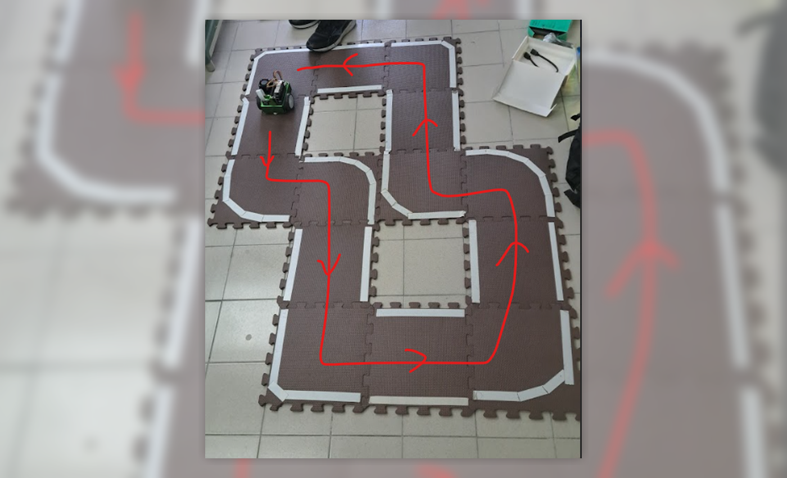
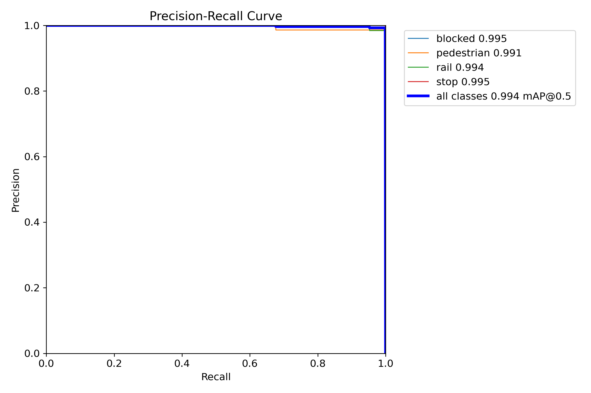
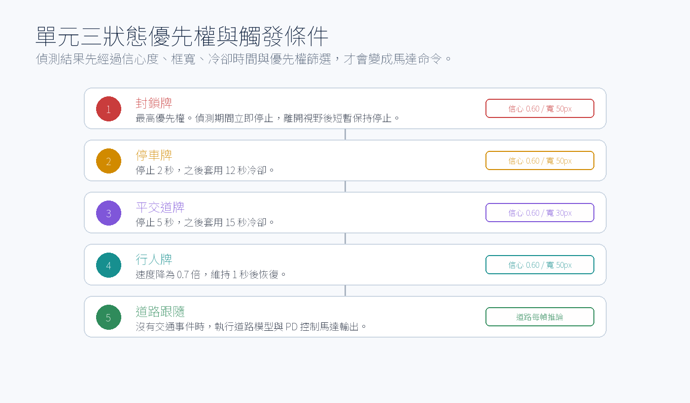

多媒體技術與應用

# 第 1 組期末專案報告

## Final Project: JetBot Autonomous Road Following and Traffic Sign Recognition

{width=5.2in}

組別：第 1 組

**班級、姓名與學號：**  
電資二 113820020 林政德  
電資二 113820033 謝奕宏  
電資二 112820034 呂伊茹  

日期：2026.06.24

<div style="page-break-after: always;"></div>

## 一、實驗內容

### 1.1 專案目標

本期末專案將本學期完成的兩個 JetBot 子任務整合成一套可實際部署於 NVIDIA Jetson Nano 自走車上的自主駕駛系統。最終部署版本位於：

```text
.deploy_jetbot/Final_team_1.ipynb
```

此筆記本是實際放入 JetBot 的主控程式，也是本報告的主要講述對象。報告後續會以 Notebook 中的 **單元一、單元二、單元三** 為主線，說明我們如何從單功能測試逐步走到最終整合展示。系統的核心目標如下：

1. **自主道路跟隨**：使用 ResNet-18 迴歸模型預測畫面中的道路目標點 `(X, Y)`，再轉換為左右馬達差速控制，使 JetBot 能沿著賽道穩定行駛。
2. **交通路牌辨識與行為控制**：使用 YOLOv4-tiny TensorRT 模型辨識 `stop`、`rail`、`pedestrian`、`blocked` 四類號誌，並依照路牌優先權執行停車、減速或安全停止。
3. **雙模型整合部署**：在 Jetson Nano 4GB 記憶體與 GPU 資源有限的條件下，透過 TensorRT、分頻推論、單相機串流與 CUDA context 管理，使雙模型能在同一台 JetBot 上穩定運作。
4. **實車可調校性與安全性**：將主控程式拆成三個單元，分別測試道路跟隨、路牌辨識與最終整合版本；每個單元皆設計安全停止 Cell，以避免相機資源佔用、GPU 記憶體殘留與馬達失控。

本專案不是單純的離線模型測試，而是完整的邊緣 AI 系統整合。模型必須在 JetBot 上即時推論，推論結果必須立即轉換為馬達輸出，且車輛在遇到不同交通號誌時必須做出符合規則的動作。

### 1.2 最終部署內容

實際部署至 JetBot 的資料夾為 `.deploy_jetbot`，主要內容可分為五類：

- **主控程式**：`Final_team_1.ipynb`。實車執行的 Jupyter Notebook，包含 TensorRT 轉換、三個測試單元與最終整合控制。
- **道路跟隨模型**：`road_following_model/` 內含 PyTorch 權重、ONNX、TensorRT engine 與 `TRTModule` 載入檔，供 ResNet-18 道路座標迴歸使用。
- **交通路牌模型**：`yolo/` 內含 `yolov4-tiny-416.cfg`、`yolov4-tiny-416.weights`、`yolov4-tiny-416.trt` 與 `obj.names`。
- **YOLO TensorRT 工具庫**：`trt_yolv4-tiny-master/`，提供 YOLO 推論封裝、plugin、轉換腳本與 `utils/yolo.py`。
- **部署文件**：`START_HERE.txt`、`使用說明.md`、`deploy_structure.md`，說明 JetBot 端放置位置、模型編譯流程與安全停機方式。

其中真正的最終執行入口為 `Final_team_1.ipynb`。其餘歷史 notebook 與工具檔保留於部署資料夾中，主要用於轉換、測試或追溯；正式展示時以 `Final_team_1.ipynb` 的單元三為準。因此本報告不是以檔案清單為中心，而是以這份主控 Notebook 的三段式設計為中心。

### 1.3 系統架構概觀

本系統由「道路跟隨模型」、「路牌偵測模型」與「行為控制狀態機」三部分組成。整體流程如下：

{width=5.5in}

在最終整合單元中，Camera 解析度設定為 `224x224`、FPS 設定為 `10`。道路模型每一幀皆執行；YOLO 則使用 `YOLO_INTERVAL = 3`，每 3 幀才將影像放大至 `416x416` 執行一次路牌推論。此設計可讓道路跟隨保持高頻率控制，同時避免 YOLO 偵測佔用過多 GPU 時間。

### 1.4 核心技術對照表

本整合專案部署時採用的關鍵技術如下：

- **邊緣運算平台**：NVIDIA Jetson Nano / JetBot，負責 CSI 相機輸入、GPU 推論與馬達控制。
- **道路跟隨模型**：ResNet-18 Coordinate Regression，輸出道路目標點 `(X, Y)`。
- **路牌偵測模型**：YOLOv4-tiny Object Detection，偵測 `stop`、`rail`、`pedestrian`、`blocked` 四種號誌。
- **推論加速**：TensorRT、FP16、ONNX、TRTModule，用於降低延遲與 VRAM 使用量。
- **雙模型分頻**：道路模型每幀推論，YOLO 每 3 幀推論，使車輛保持速度。
- **控制與安全**：PD Controller、彎道自適應降速、馬達死區補償、`try-except` safety latch 與 safe-stop cell。

<div style="page-break-after: always;"></div>

## 二、模型與部署支撐材料

### 2.1 道路跟隨模型訓練與評估

道路跟隨模型延續 Project 5 的成果，以 JetBot CSI 相機拍攝的道路影像作為輸入，並以人工標記的目標座標 `(X, Y)` 作為迴歸標籤。模型任務不是分類，而是直接預測車輛下一步應朝向的位置。

訓練流程如下：

1. 使用 JetBot 在跑道上收集道路影像。
2. 透過 Gamepad 標記每張影像中的目標點。
3. 將影像與座標整理成 `xy_{X}_{Y}_{uuid}.jpg` 格式。
4. 使用 ResNet-18 作為骨幹網路，將最後一層改為 2 維輸出。
5. 使用 MSE Loss 訓練模型，使輸出座標接近人工標記座標。
6. 將最佳權重儲存為 `best_steering_model_xy.pth`。

道路模型的輸入尺寸為 `224x224`，輸出為正規化後的 `(X, Y)`。訓練完成後，在測試集上的預測點與人工標記點高度重合，平均像素誤差為 **12.702 px**。下圖展示最佳與最差預測案例：

| 最佳預測案例 | 最差預測案例 |
| :---: | :---: |
| {width=2.5in} | {width=2.5in} |
| 圖 2a：最佳預測案例 | 圖 2b：最差預測案例 |

{width=5.4in}

從評估結果可觀察到，多數測試影像的誤差集中在低像素區間，表示模型已能穩定掌握道路中心方向。少數較大誤差通常出現在急彎、光線變化或道路邊界不清楚的影像，這也是後續在控制器加入彎道自適應降速的原因之一。

| 實體賽道與行駛方向 | 道路模型預測視覺化 |
| :---: | :---: |
| {width=2.5in} | {width=2.5in} |
| 圖 4a：期末實體賽道與行駛方向 | 圖 4b：道路模型預測點與標記點比對 |

### 2.2 道路 TensorRT 轉換

JetBot 的 Jetson Nano 雖具備 GPU，但資源遠低於桌面訓練環境。若直接使用 PyTorch 模型執行推論，延遲會影響控制穩定性，使車輛在彎道反應過慢。因此最終版本在 JetBot 端將道路模型轉換為 TensorRT。

`Final_team_1.ipynb` 的 Cell 2 負責道路模型轉換，流程如下：

{width=5.7in}

轉換時優先使用 FP16 半精度編譯：

```bash
/usr/src/tensorrt/bin/trtexec \
  --onnx=road_following_model/best_steering_model_xy.onnx \
  --saveEngine=road_following_model/best_steering_model_xy.engine \
  --fp16 \
  --workspace=1024
```

若 FP16 編譯失敗，程式會自動降級為 FP32，確保模型仍能在 JetBot 上完成轉換。轉換完成後，程式會重新載入 PyTorch 模型與 TensorRT 模型，使用相同輸入做一致性檢查。最終部署版本實測 `max_diff = 0.000520`，小於 `0.01` 的容許誤差，因此可確認 TensorRT 轉換沒有造成明顯精度失真。

此處特別使用暫存檔與 `os.replace()` 原子替換，避免在轉換失敗時留下不完整的 `best_steering_model_xy_trt.pth`，提升部署可靠性。

### 2.3 路牌辨識模型與類別定義

交通路牌辨識延續 Project 6 的 YOLOv4-tiny 訓練成果。最終部署版本使用 TensorRT 引擎：

```text
.deploy_jetbot/yolo/yolov4-tiny-416.trt
```

路牌類別檔 `obj.names` 定義如下：

```text
stop
rail
pedestrian
blocked
```

因此程式中的 class id 對應為：

| Class ID | 類別名稱 | JetBot 動作 |
| :---: | :---: | :--- |
| 0 | `stop` | 原地停止 2 秒，之後繼續道路跟隨 |
| 1 | `rail` | 原地停止 5 秒，之後繼續道路跟隨 |
| 2 | `pedestrian` | 降速為 0.7 倍，維持 1 秒後恢復 |
| 3 | `blocked` | 最高優先權安全停止；偵測期間持續停止 |

YOLOv4-tiny 在驗證集上的 F1-Score 達到 **0.9330**，獨立測試集準確率達到 **97.06%**。下圖為訓練與評估結果：

{width=3.6in}

圖 6 保留 YOLOv4-tiny 的 bounding box、類別名稱與 confidence，用來呈現 JetBot 實際部署時的相機視角與偵測條件。

| 歸一化混淆矩陣 | YOLO F1-Score 曲線 |
| :---: | :---: |
| {width=2.0in} | {width=2.0in} |
| 圖 7a：歸一化混淆矩陣 | 圖 7b：YOLOv4-tiny F1 評估曲線 |

{width=4.2in}

YOLO 推論信心度門檻設定為 `0.6`。在實車環境中，除了信心度之外，系統也加入 bounding box 寬度門檻，避免遠處路牌、背景路牌或畫面邊緣誤判造成錯誤停車。

### 2.4 主控 Notebook 三個測試單元入口

最終部署的 `Final_team_1.ipynb` 分為三個單元。這樣的設計能在實車調校時逐步隔離問題，避免道路控制、YOLO 偵測與 CUDA 資源互相干擾。

三個測試單元分別為：

- **單元一 A1-A7：純道路跟隨測試**。只載入道路模型，調整 Speed、P Gain、D Gain、Bias。
- **單元二 B1-B7：純路牌辨識測試**。只載入 YOLO，測試 Stop、Rail、Pedestrian、Blocked 動作。
- **單元三 C1-C7：最終整合版本**。同時載入道路模型與 YOLO，進行完整賽道展示。

每個單元最後皆有安全停止 Cell。切換單元前必須先執行對應的 A7、B7 或 C7，確保：

- 解除 `camera.observe()` callback。
- 停止 JetBot 馬達。
- 停止 Camera。
- 同步 CUDA context。
- 釋放模型物件與 GPU cache。
- 必要時重置 `Camera._instance`，避免 GStreamer 相機被佔用。

這是實車部署中非常重要的工程細節。如果舊 callback 或相機 pipeline 沒有關閉，JetBot 可能出現 `Resource busy`、畫面全黑、GPU OOM 或馬達維持最後一次輸出的危險狀況。

<div style="page-break-after: always;"></div>

## 三、Final_team_1.ipynb 三單元總覽

本專案最終版本不是把所有功能直接寫在同一段程式中，而是將實車部署流程明確拆成 **單元一、單元二、單元三**。這三個單元全部位於 `.deploy_jetbot/Final_team_1.ipynb`，也是實際放到 JetBot 上執行的主控流程。

這樣設計的原因很直接：JetBot 是實體車，不適合一開始就同時啟動道路模型、YOLO、CUDA context 與馬達控制。若直接跑最終版，一旦車輛壓線、路牌誤觸或相機被占用，就很難判斷問題來源。因此 Notebook 採用「先拆開測，再合併」的方式。

`Final_team_1.ipynb` 的三個主單元如下：

| Notebook 單元 | Cell 範圍 | 主要目的 | 通過標準 |
| :--- | :--- | :--- | :--- |
| **單元一：純道路跟隨測試** | A1-A7 | 只測 ResNet-18 道路模型、PD 控制與馬達輸出 | JetBot 能沿道路前進，直道不蛇行，彎道不明顯外拋 |
| **單元二：純交通路牌辨識測試** | B1-B7 | 只測 YOLOv4-tiny 與四類路牌動作 | Stop、Rail、Pedestrian、Blocked 皆能觸發正確行為 |
| **單元三：合併最終版** | C1-C7 | 同時整合道路跟隨與路牌辨識 | 能完成賽道，並在行駛中處理交通號誌 |

三個單元之間不是彼此獨立的展示，而是一條逐步驗證鏈：單元一先證明車可以穩定走路，單元二再證明車看得懂路牌，單元三最後才把兩者合併成期末驗收版本。

{width=5.7in}

因此本報告在說明三個單元時，不採用單純流水帳式的執行順序，而是針對每個單元依序說明：**問題定位、輸入與處理流程、參數與控制策略、進入下一階段的判斷依據**。

## 四、單元一：純道路跟隨測試

在 `Final_team_1.ipynb` 中，單元一對應 A1-A7。此單元只載入道路跟隨模型，不載入 YOLO，也不執行交通號誌狀態機。它的任務是先確認 JetBot 本身能不能穩定沿著道路行駛。

單元一的目標是排除 YOLO 與 PyCUDA 的干擾，只檢查道路模型與馬達控制。若車輛在此單元就無法穩定行駛，問題通常來自道路模型、相機畫面、PD 參數或馬達偏差，而不是路牌辨識。

單元一實際要回答的是：「只靠道路模型與 PD 控制，JetBot 是否能穩定跑完基本路線？」因此它的輸入、處理與輸出非常明確：

| 階段 | 單元一內容 |
| :--- | :--- |
| 輸入 | JetBot Camera `224x224` 影像 |
| 模型 | `road_following_model/best_steering_model_xy_trt.pth` |
| 推論結果 | ResNet-18 TensorRT 輸出道路目標點 `(x, y)` |
| 控制方法 | 將 `(x, y)` 轉為轉向角，再用 PD 控制計算左右輪差速 |
| 輸出 | `robot_r.left_motor.value` 與 `robot_r.right_motor.value` |
| 通過條件 | 車輛能沿著白線賽道行駛，直道不明顯蛇行，彎道不持續外拋 |

這裡的重點不是「模型有跑起來」，而是模型輸出的座標必須能穩定轉成馬達控制。若模型預測點偶爾偏移，但 PD 控制仍能把車頭拉回道路中心，單元一就算達到可整合狀態；反之，如果車輛在沒有 YOLO 的情況下仍然壓線或蛇行，就不能進入單元三，因為整合後只會更難判斷問題來源。

{width=5.5in}

| 參數 | 最終設定 |
| :--- | :--- |
| Camera 解析度 | `224x224` |
| FPS | `10` |
| Speed 初始值 | `0.15` |
| P Gain 初始值 | `0.10` |
| D Gain 初始值 | `0.02` |
| Bias 初始值 | `0.02` |
| 馬達死區補償 | `MIN_MOTOR_SPEED = 0.12` |

單元一實車調整後的 PID 與速度設定如下。這組參數的目標不是追求最高瞬間速度，而是在直道保持穩定、彎道不外拋，並讓單元三整合 YOLO 後仍有足夠控制餘裕。

| 調整項目 | 最終採用值 | 調整理由 |
| :--- | :---: | :--- |
| Speed | `0.15` | 在速度與穩定性之間取得平衡，保留 YOLO 推論造成的控制延遲餘裕 |
| P Gain | `0.10` | 提供足夠轉向修正力，讓車頭能快速回到道路中心 |
| D Gain | `0.02` | 抑制直道蛇行與出彎震盪，避免 P Gain 單獨作用造成過度修正 |
| Bias | `0.02` | 補償實車左右輪與車體微小偏差，使直道行駛時不需持續依靠 P 項修正 |
| Curve Scale 下限 | `0.60` | 急彎時最低降至設定速度的 60%，降低壓線風險 |
| 馬達死區補償 | `0.12` | 避免低速差速時馬達輸出太小而不轉動 |

道路模型輸出 `(x, y)` 後，程式先將目標點轉成車體前方的轉向角：

```python
y_forward = max((0.5 - y) / 2.0, 0.05)
angle = np.arctan2(x, y_forward)
```

接著以 PD 控制器計算轉向量：

```python
now = time.monotonic()
dt = 0.1 if control_time_last_r is None else max(now - control_time_last_r, 0.02)
derivative = 0.0 if not pd_initialized_r else (angle - angle_last_r) * min(0.1 / dt, 2.0)
pid = angle * p_slider_r.value + derivative * d_slider_r.value
steering = pid + bias_slider_r.value
```

此處使用 `time.monotonic()`，是為了讓 D 項根據穩定的相對時間計算，不受系統時間校正影響。為了避免急彎時車速過快，程式再加入彎道自適應降速：

```python
curve_scale = max(1.0 - abs(steering), 0.6)
base_speed = speed_slider_r.value * curve_scale
```

最後，為了解決 JetBot 低速時馬達不轉的死區問題，左右輪輸出會經過線性補償：

```python
MIN_MOTOR_SPEED = 0.12
if left_motor > 0.01:
    left_motor = MIN_MOTOR_SPEED + (1.0 - MIN_MOTOR_SPEED) * left_motor
if right_motor > 0.01:
    right_motor = MIN_MOTOR_SPEED + (1.0 - MIN_MOTOR_SPEED) * right_motor
```

單元一的驗證重點是：畫面中的綠色預測點是否落在合理道路中心、車輛是否能直道不蛇行、彎道是否能提前轉向、馬達左右偏差是否可透過 Bias 修正。

| 道路模型預測結果 | 像素誤差分布 |
| :---: | :---: |
| {width=2.5in} | {width=2.5in} |
| 圖 11a：道路目標點預測 | 圖 11b：測試集像素誤差 |

單元一確認完成後，代表 JetBot 已具備最基本的自主循跡能力，後續整合只需處理路牌事件如何覆蓋或調整道路控制。

## 五、單元二：純交通路牌辨識測試

在 `Final_team_1.ipynb` 中，單元二對應 B1-B7。此單元只載入 YOLOv4-tiny 路牌模型，不執行道路跟隨。測試時 JetBot 可以架高輪子或以直線慢速前進，目標是確認四種路牌事件都能正確觸發。

單元二的目標是單獨驗證 YOLOv4-tiny 的路牌辨識與行為狀態機。此單元不做道路跟隨，因此車輛只需要直線慢速前進或在架高狀態下測試路牌反應。這樣可以避免把「轉向不穩」誤判成「路牌控制錯誤」。

單元二實際要回答的是：「JetBot 看見路牌後，是否會觸發正確且不重複的動作？」因此這一單元不追求轉向表現，而是專門檢查偵測門檻、類別優先權與冷卻時間。

| 階段 | 單元二內容 |
| :--- | :--- |
| 輸入 | JetBot Camera `416x416` 影像 |
| 模型 | `yolo/yolov4-tiny-416.trt` |
| 推論結果 | YOLO 輸出 bounding boxes、confidence、class id |
| 觸發條件 | Confidence `0.60` 且 bounding box 寬度達門檻 |
| 狀態控制 | `blocked > stop > rail > pedestrian` |
| 輸出 | 停車、定時停止、減速或直線前進 |
| 通過條件 | 四種路牌都能觸發正確動作，且 Stop / Rail 不會連續重複觸發 |

這裡最重要的判斷不是「YOLO 有沒有框到東西」，而是「框到之後該不該讓車做動作」。實車畫面中可能出現遠方路牌、背景反光、邊緣殘影或同一張路牌連續出現在多幀中，因此單元二把 confidence、框寬、冷卻時間與優先權分開處理，避免把偵測結果直接等同於控制命令。

{width=5.5in}

| 參數 | 最終設定 |
| :--- | :--- |
| Camera 解析度 | `416x416` |
| FPS | `10` |
| YOLO 信心度 | `0.6` |
| Base Speed 初始值 | `0.18` |
| Alert Width 初始值 | `50 px` |
| Stop 停止時間 | `2 秒` |
| Rail 停止時間 | `5 秒` |
| Stop 冷卻時間 | `12 秒` |
| Rail 冷卻時間 | `15 秒` |
| Pedestrian 減速倍率 | `0.7x`，維持 `1 秒` |

單元二的信心度與觸發門檻設定如下。正式測試時並不是只要 YOLO 看見路牌就立刻觸發，而是同時檢查信心度、框寬與冷卻時間，降低遠方路牌與背景誤判造成的錯誤動作。

- **Stop (Class 0)**：Confidence `0.60`、框寬門檻 `50 px`，觸發後停止 2 秒。
- **Rail (Class 1)**：Confidence `0.60`、框寬門檻 `30 px`，觸發後停止 5 秒。
- **Pedestrian (Class 2)**：Confidence `0.60`、框寬門檻 `50 px`，觸發後以 0.7 倍速度減速 1 秒。
- **Blocked (Class 3)**：Confidence `0.60`、框寬門檻 `50 px`，最高優先權，偵測期間立即停止。

本專案的路牌類別順序以 `obj.names` 為準：

| Class ID | 類別 | 單元二測試動作 |
| :---: | :---: | :--- |
| 0 | `stop` | 偵測到近距離 stop 後停止 2 秒 |
| 1 | `rail` | 偵測到 rail 後停止 5 秒 |
| 2 | `pedestrian` | 速度降為 0.7 倍，通過後恢復 |
| 3 | `blocked` | 立即停止，優先權最高 |

路牌動作優先權如下：

```text
blocked > stop > rail > pedestrian
```

防誤判是單元二最重要的設計。實車測試中，畫面可能同時看到遠方路牌、背景反光或邊緣殘影，如果只靠信心度會太容易誤觸。因此程式同時檢查信心度、框寬、冷卻時間與類別優先權：

```python
width_thresholds = {
    0: slider_val,               # stop
    1: max(20, slider_val - 20), # rail
    2: slider_val,               # pedestrian
    3: slider_val                # blocked
}
```

Rail 路牌在畫面中通常比 Stop 小，所以門檻比其他類別低 20 px，但仍保留最低 20 px 限制。Stop 與 Rail 也加入冷卻時間，避免車輛剛起步還沒離開路牌，就再次被同一張卡片觸發。

| YOLO 訓練結果曲線 | YOLO PR 曲線 |
| :---: | :---: |
| {width=2.5in} | {width=2.5in} |
| 圖 13a：YOLO 訓練結果 | 圖 13b：Precision-Recall 曲線 |

單元二確認完成後，代表每個交通號誌都能被正確辨識，且能觸發預期動作。此時才進入單元三，將路牌狀態機與道路跟隨控制合併。

## 六、單元三：合併最終版

在 `Final_team_1.ipynb` 中，單元三對應 C1-C7。此單元是實際期末展示用的完整模式，會同時執行道路跟隨、YOLO 路牌偵測、狀態機判斷與馬達控制。

單元三是期末展示使用的最終版本，也是 `Final_team_1.ipynb` 中真正用於驗收的主程式。它同時載入道路跟隨 TensorRT 模型與 YOLOv4-tiny TensorRT 模型，並透過分頻推論與狀態機把兩種任務整合成同一個 callback。

單元三在 Notebook 中的 Cell 分工如下。這個分工讓展示前可以逐步檢查模型、相機、控制介面、主迴圈與安全停止，而不是一次執行所有程式。

| Cell | 程式角色 | 實際功能 | 若此步驟失敗代表 |
| :---: | :--- | :--- | :--- |
| C1 | 匯入完整套件 | 載入 Torch、OpenCV、JetBot、YOLO 工具庫與 plugin | 部署路徑或 YOLO 工具庫位置錯誤 |
| C2 | 載入雙模型 | 載入道路 `TRTModule` 與 YOLOv4-tiny TensorRT | 模型檔缺失、TensorRT engine 不相容或 CUDA context 異常 |
| C3 | 初始化相機與馬達 | 建立 `224x224` Camera 與 Robot 物件 | 相機被舊單元占用或 GStreamer pipeline 未釋放 |
| C4 | 建立控制介面 | 建立 Speed、P Gain、D Gain、Bias、Alert Width 滑桿與遙測欄位 | 參數無法即時調整，實車調校效率下降 |
| C5 | 合併主迴圈 | 執行道路推論、YOLO 分頻、狀態機與馬達輸出 | 單元三核心邏輯錯誤 |
| C6 | 啟動單元三 | 重置狀態變數，先做一次推論，再註冊 camera observer | 首幀推論失敗或安全鎖啟動 |
| C7 | 安全停止 | 解除 observer、停馬達、停相機、釋放模型與 GPU cache | 切換單元或重跑時可能資源卡住 |

單元三實際要回答的是：「在 JetBot 的有限運算資源下，道路跟隨與路牌辨識能不能同時運作，並且不互相干擾？」這一單元不是把單元一、單元二程式碼相加而已，而是重新決定兩個模型的執行頻率、影像尺寸、CUDA context 管理與事件優先權。

| 整合問題 | 單元三採用的做法 | 原因 |
| :--- | :--- | :--- |
| 道路控制需要高頻率 | 道路模型每幀推論 | 車輛轉向延遲會直接造成壓線 |
| YOLO 推論較重 | YOLO 每 3 幀推論一次 | 降低 GPU 負載，避免道路控制卡頓 |
| 兩模型輸入尺寸不同 | 主相機 `224x224`，YOLO 時 resize 到 `416x416` | 保留道路控制速度，同時符合 YOLO 輸入需求 |
| PyCUDA 與 PyTorch 共用 GPU | YOLO 前後 `cuda_context_f.push()` / `pop()` | 避免 CUDA context 衝突 |
| 停車期間仍可能出現 blocked | 定時停車時仍週期性執行 YOLO | 讓 blocked 能覆蓋 Stop / Rail，維持安全優先 |
| 同一張路牌可能重複觸發 | Stop 冷卻 `12 秒`，Rail 冷卻 `15 秒` | 起步後不會被同一路牌再次停車 |

因此單元三的驗收標準比前兩個單元更高：它不只要能沿線行駛，也要能在行駛過程中即時處理交通事件。最終最佳紀錄為 **壓線一次，時間 22.28 秒**，代表在速度、穩定性與事件處理之間已達到可展示的平衡。

{width=5.5in}

單元三的關鍵設計是：主相機使用 `224x224`，讓道路模型每一幀都可以直接推論；YOLO 則每 3 幀才執行一次，需要時才將影像放大到 `416x416`。

```python
camera_f = Camera.instance(width=224, height=224, fps=10)
YOLO_INTERVAL = 3
run_yolo = (frame_count_f % YOLO_INTERVAL == 0)
if run_yolo:
    img_yolo = cv2.resize(img, (416, 416))
```

這樣做的原因是道路控制對頻率最敏感，若每幀都跑 YOLO，車輛會因 GPU 負載過高而轉向延遲；而路牌本身在畫面中的變化速度較慢，每 3 幀偵測一次仍足以反應。

{width=5.7in}

YOLO TensorRT 使用 PyCUDA，道路模型使用 PyTorch / torch2trt。為避免兩者搶占 GPU context，單元三在 YOLO 推論前後明確管理 CUDA context：

```python
cuda_context_f.push()
try:
    boxes, confs, clss = model_sign_final.detect(img_yolo, conf_th=0.6)
finally:
    cuda_context_f.pop()
```

單元三也處理了「停車期間仍需看見 blocked」這個實車問題。若車輛正在 Stop 或 Rail 定時停車，系統仍會每 3 幀執行 YOLO，使 `blocked` 可以覆蓋原本狀態並立即停止。這讓安全優先權不會因定時停車而失效。

整合版最終達成的效果如下：

| 功能 | 單元三實際表現 |
| :--- | :--- |
| 道路跟隨 | ResNet-18 每幀推論，車輛可沿賽道行駛 |
| YOLO 偵測 | 每 3 幀推論一次，降低 GPU 負載 |
| Stop | 觸發後停止 2 秒，並套用 12 秒冷卻 |
| Rail | 觸發後停止 5 秒，並套用 15 秒冷卻 |
| Pedestrian | 觸發後 0.7 倍減速，維持 1 秒 |
| Blocked | 最高優先權，偵測期間立即停止 |
| 安全例外 | callback 出錯時 `robot.stop()` 並設定 safety latch |

單元三的重點不是單純把兩個模型同時載入，而是讓兩個模型以不同頻率協作：道路模型負責每幀控制，YOLO 負責較低頻率的環境事件判斷，狀態機再決定是否覆蓋道路控制。這也是本專案從單一模型作業進展到完整自走車系統的核心。

<div style="page-break-after: always;"></div>

## 七、單元三內部流程與狀態機

### 7.1 每一幀的控制流程

最終版 `execute_final()` 每收到一張相機影像，會依照下列順序執行：

1. 讀取 `224x224` 相機影像。
2. 檢查是否處於 safety latch 或 blocked stop 狀態。
3. 判斷目前是否在 Stop / Rail 定時停車時間內。
4. 每 3 幀執行一次 YOLO；其他影格沿用上一輪偵測快取。
5. 根據 YOLO 結果做信心度、框寬、冷卻時間與優先權判定。
6. 若觸發 Stop 或 Rail，立即停車並提早 return。
7. 若觸發 Pedestrian，設定 1 秒減速 latch。
8. 若觸發 Blocked，立即停止並更新 blocked 時間戳。
9. 若可繼續行駛，執行道路模型推論。
10. 以 PD 控制、彎道降速與馬達死區補償計算左右輪輸出。
11. 更新畫面上的目標點、路牌框、動作文字與遙測資訊。

### 7.2 狀態機決策

狀態機以安全優先為原則，決策順序如下：

1. **Blocked Stop**：只要偵測到 `blocked` 且框寬達門檻，立即停止並覆蓋其他狀態。
2. **Timed Stop**：偵測到 `stop` 停止 2 秒；偵測到 `rail` 停止 5 秒。
3. **Pedestrian Slow**：偵測到 `pedestrian` 後，以 0.7 倍速度減速 1 秒。
4. **Lane Following**：沒有安全事件時，才執行道路跟隨與 PD 馬達控制。
5. **Safety Stop**：任何 callback 例外都會呼叫 `robot.stop()`，並設定 safety latch。

Stop 與 Rail 的定時停車期間仍會定期執行 YOLO，確保 `blocked` 可以立即升級為最高優先權的安全停止。

Blocked 在最終程式中使用 `last_blocked_time_f` 記錄最後一次看見 blocked 的時間，並在偵測期間與離開視野後短時間內持續停止。這讓車輛在實際展示時，只要道路封閉牌仍在前方，就會保持停止，不會因單幀漏檢立刻重新起步。

{width=5.6in}

### 7.3 雙模型分頻時序

道路跟隨與馬達控制需要高頻率更新，因此每幀都執行。路牌變化相對較慢，不需要每一幀都執行 YOLO。圖 15 顯示單元三的分頻方式：Frame 1、2 先沿用 YOLO 快取，Frame 3 執行一次 YOLO 偵測，Frame 4、5 再沿用快取，Frame 6 再次偵測。透過每 3 幀一次的分頻策略，系統能在保留路牌反應能力的同時，明顯降低 GPU 負載。

### 7.4 最終效能結果

最終整合版本在 JetBot 上能完成道路跟隨與路牌反應。相較於未優化的雙模型直接推論，最終版本透過 TensorRT 與分頻策略提升實車速度與穩定性。

{width=5.7in}

| 項目 | 結果 |
| :--- | :--- |
| 道路模型 | ResNet-18 TensorRT，輸入 `224x224` |
| 路牌模型 | YOLOv4-tiny TensorRT，輸入 `416x416` |
| 相機主串流 | `224x224`, `10 FPS` |
| YOLO 分頻 | 每 3 幀推論一次 |
| 道路控制 | 每幀推論與馬達輸出 |
| 道路模型轉換誤差 | `max_diff = 0.000520` |
| 道路預測平均像素誤差 | `12.702 px` |
| YOLO 驗證 F1-Score | `0.9330` |
| YOLO 獨立測試準確率 | `97.06%` |
| 整合推論速度 | 約 10 FPS 以上 |

實車測試中，JetBot 能在跑道上跟隨道路行駛，並對 Stop、Rail、Pedestrian、Blocked 做出對應動作。彎道自適應降速有效降低急彎壓線機率；冷卻時間與框寬門檻則降低了路牌重複觸發與遠距離誤觸問題。

<div style="page-break-after: always;"></div>

## 八、遇到的問題與解決方式

### 8.1 工程問題整理

本專案主要遇到的問題與解決方式如下：

- **相機資源被占用**：切換單元時舊的 Camera pipeline 或 observer 未釋放，會造成 `Resource busy`。解法是在每個單元設計 A7 / B7 / C7 安全停止 Cell。
- **PyTorch 推論延遲過高**：Jetson Nano 直接跑 PyTorch 反應太慢。解法是在 JetBot 端轉換成 TensorRT engine，並包裝為 TRTModule。
- **TensorRT engine 無法跨機器使用**：engine 與 JetPack、CUDA、TensorRT 版本高度相關。解法是在目標 JetBot 上重新編譯。
- **YOLO 與 PyTorch 同時使用 GPU 不穩**：PyCUDA 與 PyTorch 會競爭 CUDA context。解法是在 YOLO 推論前後明確 `push()` / `pop()`。
- **停車後起步暴衝**：停車期間若累積舊畫面的 PD 狀態，起步時會使用過期轉向資訊。解法是定時停車期間直接 `return`，並重置 PD 狀態。
- **遠處路牌提前觸發**：只看信心度不足以避免背景路牌誤判。解法是加入 bounding box 寬度門檻。
- **Stop / Rail 重複停車**：車輛起步後仍在同一路牌前方。解法是 Stop 設定 12 秒冷卻，Rail 設定 15 秒冷卻。
- **低速馬達不動與急彎壓線**：低速輸出不足或急彎速度過快。解法是使用 `MIN_MOTOR_SPEED = 0.12` 與彎道自適應降速。

### 8.2 實車調校策略

本專案在實車測試時採用逐步調校，而不是直接啟動最終整合版本。調校順序如下：

1. **先測單元一道路跟隨**  
   確認道路模型方向正確，車輛能沿賽道前進。此階段只調 Speed、P Gain、D Gain、Bias。

2. **再測單元二路牌辨識**  
   不讓車輛轉向，只測路牌偵測與對應動作。此階段調整 Alert Width、信心度與各類別行為。

3. **最後測單元三整合版**  
   同時啟動道路跟隨與 YOLO，觀察雙模型是否互相影響，並微調速度與路牌框寬。

4. **每次切換都執行安全停止 Cell**  
   這是避免 JetBot 相機與 GPU 資源卡住的必要流程。

5. **先低速再加速**  
   初次上車測試以 `Speed = 0.10 ~ 0.15` 為主，確認安全後再逐步提高。

此調校方式能快速定位問題來源。例如若車子壓線，優先看道路模型與 PD 控制；若路牌不觸發，優先看 YOLO 信心度與框寬；若整合後變慢，則檢查 YOLO 分頻與 CUDA context。

### 8.3 安全注意事項

JetBot 是實體車輛，軟體錯誤可能造成馬達持續輸出。因此本組在測試時採用以下安全原則：

- 第一次執行任一控制單元時，先將車輪架空。
- 每次切換單元前，先執行安全停止 Cell。
- 若相機畫面全黑或 Camera stop 失敗，重啟 Jupyter kernel，不直接執行下一個單元。
- 若 JetBot 端系統、kernel 或供電異常，Notebook 內的安全鎖可能無法執行，因此實車旁需保留人工斷電能力。
- 調整 Speed 時小幅增加，不直接使用高速度。

<div style="page-break-after: always;"></div>

## 九、成果展示

### 9.1 實驗展示畫面

下圖為期末專案賽道與道路模型預測視覺化結果：

| 實體賽道 | 道路預測視覺化 |
| :---: | :---: |
| {width=2.6in} | {width=2.6in} |
| 圖 18a：實車測試賽道 | 圖 18b：道路模型預測點 |

### 9.2 最終成果摘要

本專案最終完成以下成果：

1. 完成 JetBot 道路跟隨模型訓練與測試，模型能穩定預測道路中心目標點。
2. 完成道路模型 TensorRT 轉換，並在 JetBot 端通過 PyTorch / TensorRT 一致性檢查。
3. 完成 YOLOv4-tiny 四類交通路牌辨識，包含 `stop`、`rail`、`pedestrian`、`blocked`。
4. 完成雙模型整合控制，讓 JetBot 能一邊跟隨道路，一邊依照路牌做出停車或減速動作。
5. 完成防誤判機制，包含框寬過濾、冷卻時間、優先權狀態機與 pedestrian latch。
6. 完成安全停止機制，降低相機資源占用、GPU context 失敗與 callback 例外造成的風險。
7. 完成 JetBot 實車部署資料夾 `.deploy_jetbot`，可直接放入 JetBot 對應目錄執行。

### 9.3 最佳實車紀錄

期末最終版以 `Final_team_1.ipynb` 的單元三作為正式展示模式，最佳實車紀錄如下：

最佳紀錄為：**壓線一次，時間 22.28 秒**。影片紀錄將於後續補上。

| 項目 | 最佳紀錄 |
| :--- | :--- |
| 測試模式 | 單元三：道路跟隨 + 路牌辨識最終整合 |
| 完成時間 | **22.28 秒** |
| 壓線次數 | **1 次** |
| 控制參數 | Speed `0.15`、P Gain `0.10`、D Gain `0.02`、Bias `0.02` |
| YOLO 觸發設定 | Confidence `0.60`、Alert Width `50 px`、YOLO 每 3 幀推論一次 |
| 影片紀錄 | 後續補上最佳紀錄影片 |

此紀錄代表整合版在速度與穩定性之間已達到可展示狀態。雖然仍有 1 次壓線，但車輛能在雙模型同時運作下完成賽道，並維持 Stop、Rail、Pedestrian、Blocked 的事件處理能力。

### 9.4 成果連結

成果展示影片：複雜路徑  
https://youtu.be/AqjCYs9JIPk

成果展示影片：繞圓圈測試  
https://youtube.com/shorts/lWKTjqhHQUo

訓練照片集  
https://github.com/Andy87877/NTUT_Multimedia_Applications_Project5/tree/main/dataset_xy

專案 GitHub 原始碼  
https://github.com/Andy87877/NTUT_Multimedia_Applications_Project5

### 9.5 與預期結果比較

- **道路跟隨**：預期能沿直道與彎道行駛；實際上可完成道路跟隨，急彎透過動態降速改善穩定性。
- **路牌辨識**：預期能辨識四類交通路牌；實際上 YOLOv4-tiny 可辨識四類路牌，並觸發對應行為。
- **Stop / Rail**：預期能定時停車後繼續；實際上 Stop 停 2 秒、Rail 停 5 秒，並加入冷卻時間避免重複觸發。
- **Pedestrian / Blocked**：預期能減速與安全停止；實際上 pedestrian 使用 0.7 倍速度減速，blocked 具有最高優先權。
- **雙模型速度與安全性**：預期整合後不明顯卡頓；實際上透過 TensorRT 與 YOLO 分頻維持約 10 FPS 以上，並加入 safe-stop 與資源釋放流程。

<div style="page-break-after: always;"></div>

## 十、結論

本期末專案完成了一套可實際部署於 JetBot 的自主道路跟隨與交通路牌辨識整合系統。相較於單一模型示範，本專案更接近真實邊緣 AI 系統，因為它同時處理了模型推論、相機串流、GPU 資源、馬達控制、狀態機決策與實車安全等問題。

在模型層面，道路跟隨使用 ResNet-18 迴歸模型，能將相機影像轉換為車輛前進目標點；路牌辨識使用 YOLOv4-tiny，能偵測四種交通號誌。在部署層面，兩個模型皆透過 TensorRT 加速，以降低 Jetson Nano 上的推論延遲。在控制層面，系統使用 PD 控制、彎道自適應降速與馬達死區補償，使 JetBot 行駛更平順。在安全層面，系統加入 safe-stop、callback 例外捕捉、CUDA context push/pop 與冷卻時間，提升實車展示的可靠性。

最終版本的重點不只是「模型能辨識」，而是「模型能在車上穩定控制實體行為」。透過分單元測試與最終整合，本組成功將 Project 5 道路跟隨與 Project 6 路牌辨識合併成可運作的 JetBot 期末專案。

## 十一、分工

本專案由三位組員共同完成，包含資料收集、模型訓練、JetBot 實車測試、整合程式開發、部署與報告整理。分工如下：

- **呂伊茹（112820034，33%）**：道路跟隨資料收集與標記、賽道架設、實車測試、PD 參數與馬達偏差調整、小組報告內容整理與校對。
- **林政德（113820020，33%）**：交通路牌資料整理、道路模型訓練協助、YOLO 辨識測試、實車路牌動作測試、控制參數調校與結果紀錄。
- **謝奕宏（113820033，34%）**：雙模型整合程式開發、TensorRT 轉換流程、CUDA context 與 YOLO 推論整合、部署資料夾維護、成果影片整理與 GitHub 管理。
